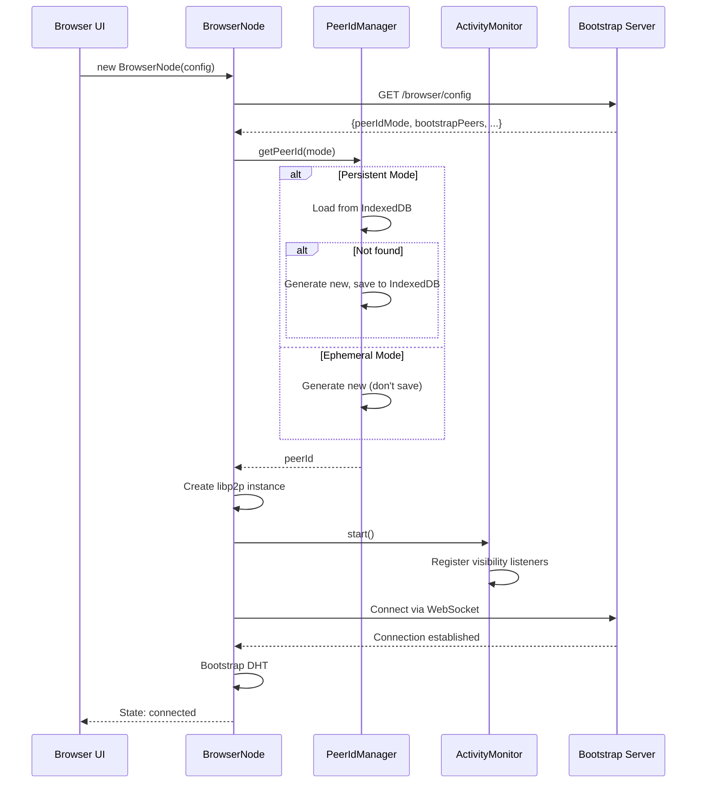
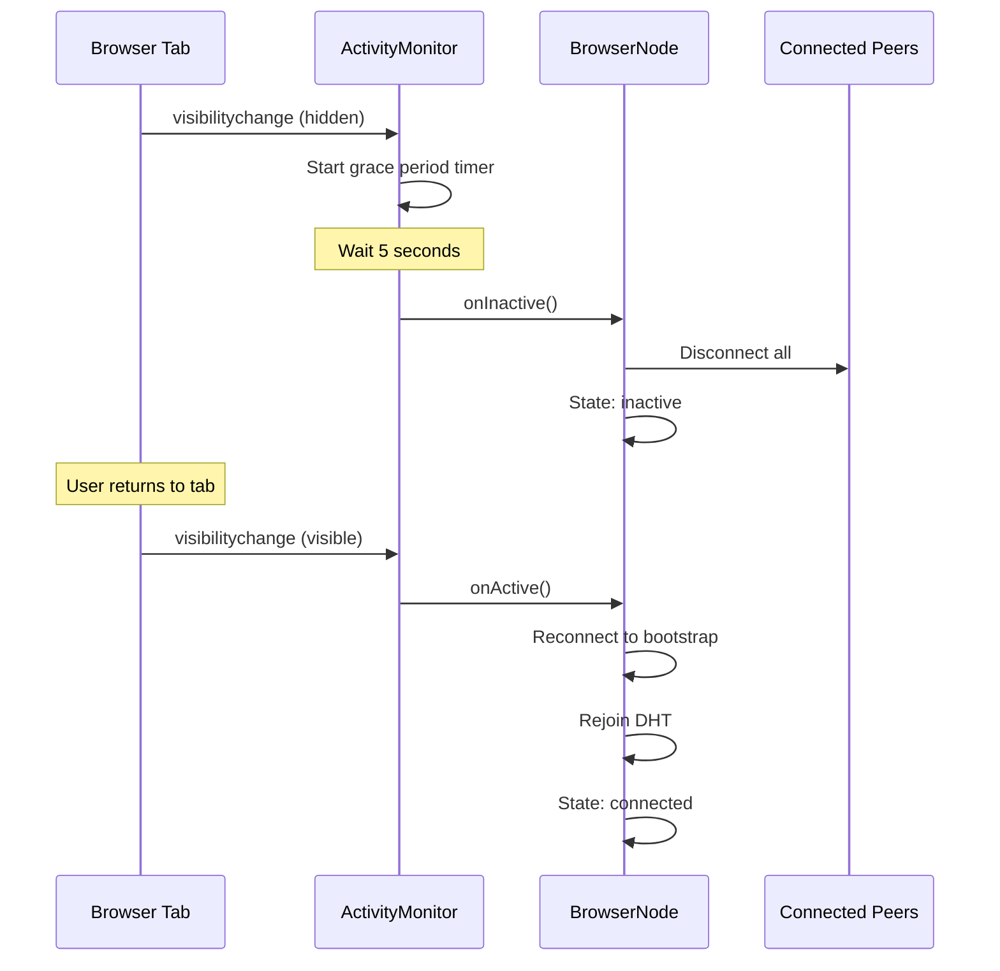
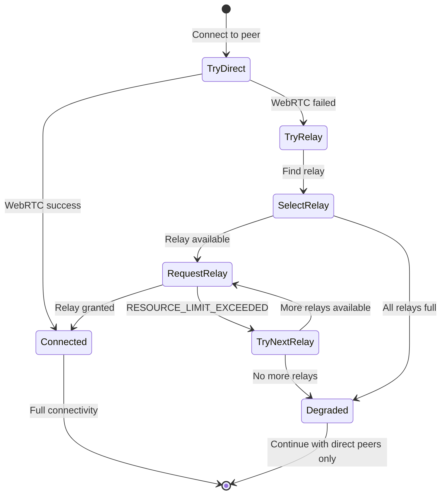

# Design Document: Browser-Native libp2p Nodes

## Overview

This design enables browsers to run full libp2p DHT nodes using WebRTC for browser-to-browser connectivity and WebSocket for server connectivity. The hybrid architecture supports both thin clients (existing) and full browser nodes (new), allowing the network to scale to thousands of browser participants.

## Architecture

```
┌─────────────────────────────────────────────────────────────────────────────┐
│                           HYBRID P2P NETWORK                                │
├─────────────────────────────────────────────────────────────────────────────┤
│                                                                             │
│  ┌──────────────┐    WebRTC     ┌──────────────┐    WebRTC    ┌──────────┐ │
│  │ Browser Node │◄────────────►│ Browser Node │◄────────────►│ Browser  │ │
│  │   (Full)     │              │   (Full)     │              │  Node    │ │
│  └──────┬───────┘              └──────┬───────┘              └────┬─────┘ │
│         │                             │                           │       │
│         │ WebSocket                   │ WebSocket                 │       │
│         │                             │                           │       │
│  ┌──────▼───────┐              ┌──────▼───────┐              ┌────▼─────┐ │
│  │ Server Node  │◄────────────►│ Server Node  │◄────────────►│ Server   │ │
│  │ (Bootstrap)  │   libp2p     │   (DHT)      │   libp2p     │  Node    │ │
│  └──────┬───────┘              └──────────────┘              └──────────┘ │
│         │                                                                  │
│         │ WebSocket (thin client)                                         │
│         │                                                                  │
│  ┌──────▼───────┐                                                         │
│  │ Thin Client  │  (existing - no libp2p, just WebSocket API)             │
│  │  (Browser)   │                                                         │
│  └──────────────┘                                                         │
│                                                                             │
└─────────────────────────────────────────────────────────────────────────────┘
```

## Components and Interfaces

### 1. BrowserNode Class

The main class for browser-side libp2p node management.

```typescript
interface BrowserNodeConfig {
  bootstrapUrls: string[];           // Server bootstrap WebSocket URLs
  peerIdMode: 'persistent' | 'ephemeral';
  maxConnections: number;            // Default: 50
  enableCircuitRelay: boolean;       // Default: true
  enableDHT: boolean;                // Default: true
  enableOverlay: boolean;            // Default: true
}

interface BrowserNodeState {
  status: 'disconnected' | 'connecting' | 'connected' | 'inactive';
  peerId: string | null;
  connectedPeers: number;
  browserPeers: number;              // Peers connected via WebRTC
  serverPeers: number;               // Peers connected via WebSocket
  routingTableSize: number;
  bytesIn: number;
  bytesOut: number;
}

class BrowserNode {
  constructor(config: BrowserNodeConfig);
  
  // Lifecycle
  async start(): Promise<void>;
  async stop(): Promise<void>;
  
  // State
  getState(): BrowserNodeState;
  onStateChange(callback: (state: BrowserNodeState) => void): void;
  
  // DHT operations
  async put(key: Uint8Array, value: Uint8Array): Promise<void>;
  async get(key: Uint8Array): Promise<Uint8Array>;
  async getClosestPeers(key: Uint8Array): AsyncIterable<PeerInfo>;
  
  // Overlay messaging
  async sendMessage(targetPeerId: string, payload: Uint8Array): Promise<Uint8Array>;
  onMessage(handler: (payload: Uint8Array, context: MessageContext) => Promise<Uint8Array>): void;
}
```

### 2. Transport Configuration

```typescript
// Browser libp2p transport stack
const transports = [
  // WebSocket for server connections
  webSockets({
    filter: filters.all  // Allow both ws:// and wss://
  }),
  
  // WebRTC for browser-to-browser
  webRTC({
    rtcConfiguration: {
      iceServers: [
        { urls: 'stun:stun.l.google.com:19302' },
        { urls: 'stun:stun1.l.google.com:19302' }
      ]
    }
  }),
  
  // Circuit relay for NAT traversal
  circuitRelayTransport({
    discoverRelays: 1  // Discover relay nodes from DHT
  })
];
```

### 3. Activity Monitor

Handles browser tab visibility and network state changes.

```typescript
interface ActivityMonitorConfig {
  disconnectOnInactive: boolean;     // Default: true
  reconnectOnActive: boolean;        // Default: true
  inactivityGracePeriod: number;     // ms before disconnect, default: 5000
}

class ActivityMonitor {
  constructor(config: ActivityMonitorConfig);
  
  // Events
  onInactive(callback: () => void): void;
  onActive(callback: () => void): void;
  onNetworkOffline(callback: () => void): void;
  onNetworkOnline(callback: () => void): void;
  
  // State
  isActive(): boolean;
  isOnline(): boolean;
  
  start(): void;
  stop(): void;
}
```

### 4. Peer ID Manager

Handles peer ID generation and persistence based on server configuration.

```typescript
interface PeerIdManagerConfig {
  mode: 'persistent' | 'ephemeral';
  storageKey: string;                // IndexedDB key for persistent mode
}

class PeerIdManager {
  constructor(config: PeerIdManagerConfig);
  
  async getPeerId(): Promise<PeerId>;
  async clearStoredPeerId(): Promise<void>;
}
```

### 5. Server Configuration Endpoint

Server exposes browser node configuration.

```typescript
// GET /browser/config
interface BrowserConfigResponse {
  peerIdMode: 'persistent' | 'ephemeral';
  bootstrapPeers: string[];          // Multiaddrs of bootstrap nodes
  relayNodes: string[];              // Multiaddrs of circuit relay nodes
  maxConnections: number;
  dhtEnabled: boolean;
  overlayEnabled: boolean;
}
```

## Data Models

### Browser Node Storage (IndexedDB)

```typescript
// Database: 'libp2p-browser-node'

// Object Store: 'identity'
interface StoredIdentity {
  id: 'primary';
  privateKey: Uint8Array;            // Ed25519 private key
  peerId: string;
  createdAt: number;
}

// Object Store: 'peers'
interface StoredPeer {
  peerId: string;
  multiaddrs: string[];
  lastSeen: number;
  connectionType: 'webrtc' | 'websocket' | 'relay';
}

// Object Store: 'dht-records'
interface StoredDHTRecord {
  key: string;                       // Base64 encoded key
  value: Uint8Array;
  expiry: number;
}
```

## Correctness Properties

*A property is a characteristic or behavior that should hold true across all valid executions of a system—essentially, a formal statement about what the system should do. Properties serve as the bridge between human-readable specifications and machine-verifiable correctness guarantees.*

### Property 1: Peer ID Mode Consistency

*For any* browser node configuration:
- In persistent mode: generating a peer ID, stopping the node, and restarting SHALL produce the same peer ID
- In ephemeral mode: generating peer IDs for N different tabs SHALL produce N unique peer IDs

**Validates: Requirements 1.2, 1.3**

### Property 2: Connection Strategy Ordering

*For any* browser node attempting to connect to another browser node, the node SHALL attempt direct WebRTC connection first, and only fall back to circuit relay after direct connection fails.

**Validates: Requirements 2.3, 2.4**

### Property 3: Activity State Transitions

*For any* browser node in connected state:
- When tab becomes inactive → node SHALL transition to disconnected state with all peers disconnected
- When tab becomes active again → node SHALL automatically reconnect and return to connected state

**Validates: Requirements 8.4, 8.5, 8.6**

### Property 4: DHT Participation Symmetry

*For any* browser node B and server node S in the same DHT network, if B can successfully query S for closest peers, then S SHALL be able to query B for closest peers.

**Validates: Requirements 4.1, 4.2, 6.1**

### Property 5: Overlay Message Delivery

*For any* two nodes (browser or server) that are both connected to the network, an overlay message sent from one to the other SHALL be deliverable (either directly or via relay/routing).

**Validates: Requirements 5.3, 5.4, 5.5**

### Property 6: Hybrid Network Interoperability

*For any* network containing a mix of browser nodes, server nodes, and thin clients:
- Browser nodes SHALL be able to exchange overlay messages with server nodes
- Thin clients SHALL be able to send overlay messages to browser nodes (via their connected server)
- Browser nodes SHALL be able to send overlay messages to thin clients (via the thin client's server)

**Validates: Requirements 6.1, 6.2, 6.3, 6.4, 6.5**

### Property 7: Connection Limit Enforcement

*For any* browser node with maxConnections=N:
- The number of active connections SHALL never exceed N
- When approaching N connections, the node SHALL prune least-recently-used connections

**Validates: Requirements 8.1, 8.2**

### Property 8: Graceful Disconnect on Tab Close

*For any* browser node with active connections, when stop() is called (tab close), all connected peers SHALL receive disconnect notifications and the connection count SHALL reach zero.

**Validates: Requirements 1.7**

### Property 9: Message Validation and Security

*For any* incoming message to a browser node:
- If the message is invalid according to protocol specifications, the connection SHALL be dropped
- The node SHALL rate-limit incoming connections to prevent DoS attacks

**Validates: Requirements 9.1, 9.2, 9.5**

### Property 10: DHT Record Storage Responsibility

*For any* browser node that is among the k-closest nodes to a key, when a PUT operation occurs for that key, the browser node SHALL store the record.

**Validates: Requirements 4.3, 4.4**

### Property 11: Public Key Publication

*For any* browser node with overlay enabled, after successful start, the node's public key SHALL be retrievable from the DHT by other nodes.

**Validates: Requirements 5.2**

### Property 12: Relay Capacity Enforcement

*For any* server node with maxReservations=N, the number of active reservations SHALL never exceed N, and new requests beyond N SHALL receive RESOURCE_LIMIT_EXCEEDED.

**Validates: Requirements 10.1, 10.3**

### Property 13: Relay Failover

*For any* browser node that receives RESOURCE_LIMIT_EXCEEDED from a relay, the browser SHALL attempt at least one alternative relay before giving up.

**Validates: Requirements 10.4, 11.3**

### Property 14: Graceful Degradation

*For any* browser node where all relay attempts fail, the node SHALL remain operational and able to communicate with directly-connectable peers.

**Validates: Requirements 10.5, 11.1**

### Property 15: Connection Upgrade Attempts

*For any* browser node with an active relayed connection, the node SHALL periodically attempt to upgrade to a direct connection.

**Validates: Requirements 10.6**

## Error Handling

### Connection Errors

| Error | Cause | Recovery |
|-------|-------|----------|
| WebRTC ICE failure | NAT/firewall blocking | Fall back to circuit relay |
| WebSocket timeout | Server unreachable | Retry with exponential backoff |
| Circuit relay unavailable | No relay nodes | Queue messages, retry when relay available |
| Max connections reached | Resource limit | Prune least-recently-used connections |

### Storage Errors

| Error | Cause | Recovery |
|-------|-------|----------|
| IndexedDB unavailable | Private browsing mode | Fall back to in-memory storage |
| Storage quota exceeded | Too much data | Prune old DHT records and peer info |
| Corrupted peer ID | Storage corruption | Generate new peer ID, log warning |

### Activity State Errors

| Error | Cause | Recovery |
|-------|-------|----------|
| Visibility API unavailable | Old browser | Use fallback polling mechanism |
| Network API unavailable | Old browser | Rely on connection errors for detection |
| Reconnect failure | Network still down | Retry with exponential backoff |

## Testing Strategy

### Unit Tests

- PeerIdManager: Test persistent vs ephemeral mode
- ActivityMonitor: Test visibility and network state detection
- BrowserNode: Test lifecycle methods (start, stop)
- Transport selection: Test WebRTC vs WebSocket vs relay selection
- Storage: Test IndexedDB operations

### Property-Based Tests

Each correctness property will be implemented as a property-based test using fast-check:

1. **Property 1 (Peer ID Mode)**: Generate random configs, verify persistent IDs survive restart, ephemeral IDs are unique
2. **Property 2 (Connection Strategy)**: Simulate connections, verify direct attempted before relay
3. **Property 3 (Activity State)**: Simulate visibility changes, verify state transitions
4. **Property 4 (DHT Symmetry)**: Create browser-server pairs, verify bidirectional DHT queries
5. **Property 5 (Overlay Delivery)**: Create node pairs, verify message delivery
6. **Property 6 (Hybrid Interop)**: Create mixed networks, verify cross-type messaging
7. **Property 7 (Connection Limits)**: Generate connection attempts exceeding limit, verify enforcement
8. **Property 8 (Graceful Disconnect)**: Simulate tab close, verify disconnect propagation
9. **Property 9 (Message Validation)**: Generate invalid messages, verify rejection and connection drop
10. **Property 10 (DHT Storage)**: Generate keys, verify k-closest nodes store records
11. **Property 11 (Key Publication)**: Start nodes, verify public keys retrievable from DHT

### Integration Tests

- Browser node connecting to server bootstrap
- Browser-to-browser WebRTC connection
- Circuit relay fallback when direct connection fails
- DHT put/get across browser and server nodes
- Overlay messaging between browser nodes
- Tab visibility change handling
- Network offline/online handling
- Thin client to browser node messaging
- Browser node to thin client messaging

## Sequence Diagrams

### Browser Node Startup



### Tab Inactive/Active Cycle



### Browser-to-Browser Connection

```mermaid
sequenceDiagram
    participant B1 as Browser Node 1
    participant S as Server (Signaling)
    participant B2 as Browser Node 2
    
    B1->>S: DHT query for B2's multiaddrs
    S-->>B1: [/webrtc/..., /p2p-circuit/...]
    B1->>B2: WebRTC offer (via signaling)
    B2-->>B1: WebRTC answer
    B1->>B2: ICE candidates exchange
    alt Direct connection succeeds
        B1<-->B2: Direct WebRTC connection
    else Direct connection fails (NAT)
        B1->>S: Request circuit relay
        S->>B2: Relay connection
        B1<-->S<-->B2: Relayed connection
    end
```

## File Structure

```
src/browser/
├── index.ts                    # Main exports
├── browser-node.ts             # BrowserNode class
├── peer-id-manager.ts          # Peer ID generation/persistence
├── activity-monitor.ts         # Tab visibility/network monitoring
├── transport-config.ts         # libp2p transport configuration
├── storage.ts                  # IndexedDB wrapper
├── types.ts                    # TypeScript interfaces
└── __tests__/
    ├── browser-node.test.ts
    ├── browser-node.property.test.ts
    ├── peer-id-manager.test.ts
    ├── peer-id-manager.property.test.ts
    ├── activity-monitor.test.ts
    └── activity-monitor.property.test.ts

public/
├── index.html                  # Existing thin client UI
└── full-node.html              # New full node UI

src/cli/
└── ws-bridge.ts                # Add /browser/config endpoint
```

## Dependencies

```json
{
  "dependencies": {
    "libp2p": "^1.0.0",
    "@libp2p/webrtc": "^4.0.0",
    "@libp2p/websockets": "^8.0.0",
    "@libp2p/circuit-relay-v2": "^1.0.0",
    "@libp2p/kad-dht": "^12.0.0",
    "@libp2p/identify": "^2.0.0",
    "idb": "^8.0.0"
  }
}
```

## Browser Compatibility

| Feature | Chrome | Firefox | Safari | Edge |
|---------|--------|---------|--------|------|
| WebRTC | ✅ | ✅ | ✅ | ✅ |
| WebSocket | ✅ | ✅ | ✅ | ✅ |
| IndexedDB | ✅ | ✅ | ✅ | ✅ |
| Page Visibility API | ✅ | ✅ | ✅ | ✅ |
| Network Information API | ✅ | ⚠️ Partial | ❌ | ✅ |

Note: For browsers without Network Information API, we fall back to detecting connection errors.

## Relay Capacity Management

### Relay Configuration

```typescript
// Server-side relay configuration
const relayConfig = {
  maxReservations: 128,        // Max browser clients using this as relay
  maxCircuits: 16,             // Max active relay circuits per peer
  reservationTTL: 3600000,     // 1 hour reservation lifetime
  
  // Per-circuit limits (prevent abuse)
  data: {
    limit: 131072,             // 128KB per circuit burst
    duration: 120000           // 2 minute max duration per circuit
  }
};
```

### Capacity Estimation

```
Per server node:     128 reservations × 16 circuits = 2,048 relay paths
60 server nodes:     60 × 128 = 7,680 total reservations
Active circuits:     60 × 16 = 960 simultaneous relay connections

Assuming 30% of browsers need relay:
  - 3,000 browsers → 900 need relay → within capacity ✅
  - 10,000 browsers → 3,000 need relay → need more nodes ⚠️
```

### Relay Selection Algorithm

```typescript
class RelaySelector {
  private relayNodes: Map<string, RelayNodeInfo> = new Map();
  
  async selectRelay(): Promise<string | null> {
    // Sort by utilization (least loaded first)
    const sorted = [...this.relayNodes.values()]
      .filter(r => r.utilization < 0.95)  // Skip nearly-full relays
      .sort((a, b) => a.utilization - b.utilization);
    
    if (sorted.length === 0) {
      console.warn('All relay nodes at capacity');
      return null;
    }
    
    // Return least loaded relay
    return sorted[0].peerId;
  }
  
  async updateRelayStatus(peerId: string): Promise<void> {
    // Fetch /relay/status from relay node
    const status = await this.fetchRelayStatus(peerId);
    this.relayNodes.set(peerId, {
      peerId,
      utilization: status.activeReservations / status.maxReservations,
      lastUpdated: Date.now()
    });
  }
}
```

### Graceful Degradation Flow



### Relay Metrics (Prometheus Format)

```
# HELP relay_reservations_active Current active relay reservations
# TYPE relay_reservations_active gauge
relay_reservations_active{node="node-1"} 45

# HELP relay_reservations_max Maximum relay reservations
# TYPE relay_reservations_max gauge
relay_reservations_max{node="node-1"} 128

# HELP relay_circuits_active Current active relay circuits
# TYPE relay_circuits_active gauge
relay_circuits_active{node="node-1"} 12

# HELP relay_reservations_rejected_total Total rejected reservations
# TYPE relay_reservations_rejected_total counter
relay_reservations_rejected_total{node="node-1"} 5

# HELP relay_bytes_total Total bytes relayed
# TYPE relay_bytes_total counter
relay_bytes_total{node="node-1",direction="in"} 1048576
relay_bytes_total{node="node-1",direction="out"} 1048576
```
