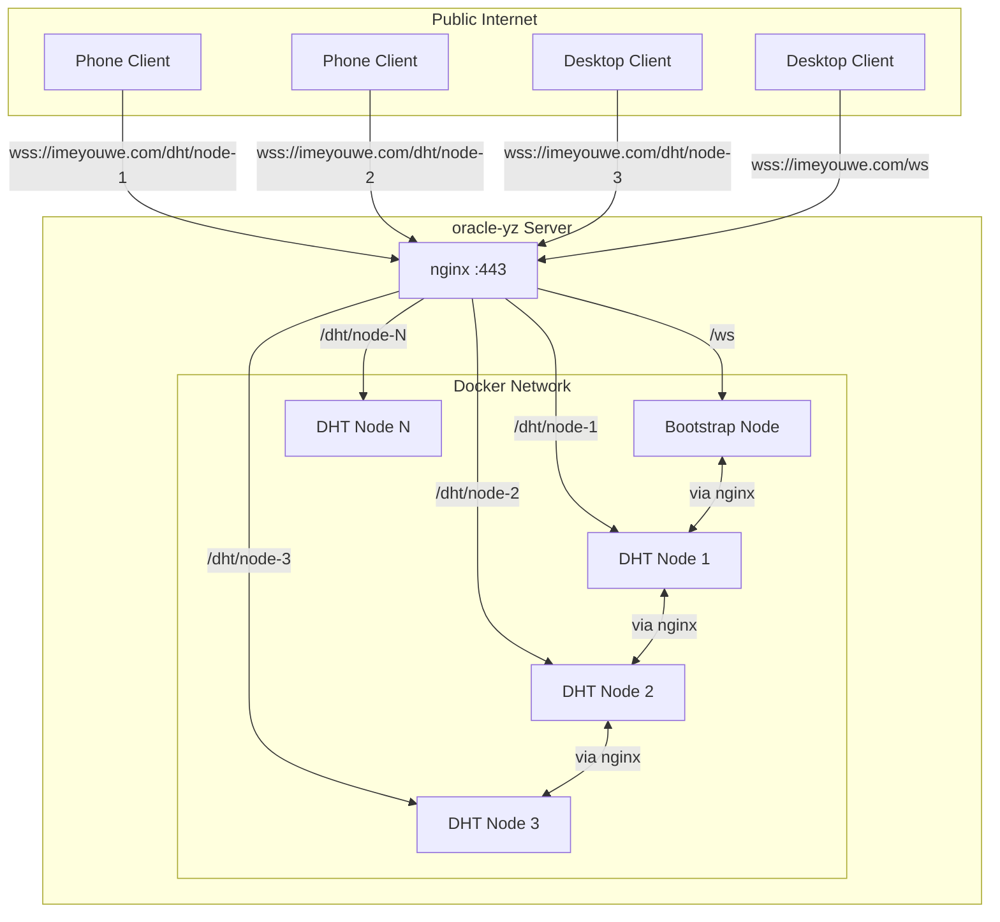
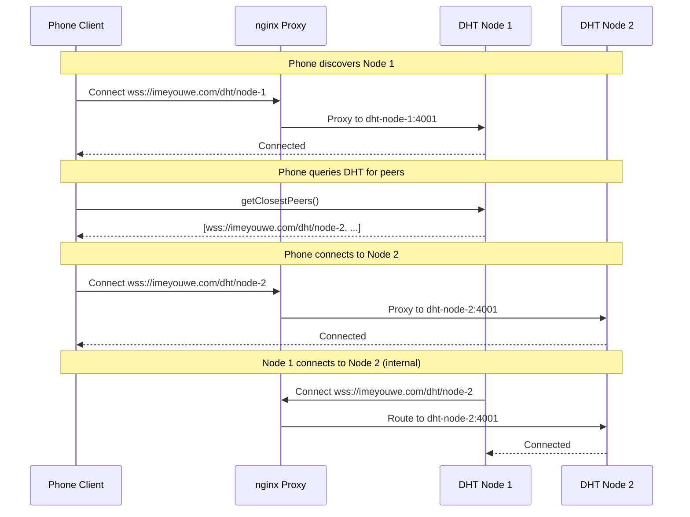

# Design Document: Public DHT Node Infrastructure

## Overview

This design describes how to make Docker-hosted DHT nodes fully accessible as part of a public DHT network. Each of the ~60 Docker nodes will have a unique public WSS address routed through nginx, allowing external clients (phones, computers) to discover and connect to any node.

The key principle is: **ALL nodes advertise ONLY public addresses**. This ensures uniform addressing regardless of whether a node is a Docker container, a phone, or a desktop computer.

## Architecture

### Network Topology



### Address Flow



## Components

### 1. nginx Configuration

nginx serves as the public entry point, routing requests to the correct Docker container.

#### Configuration Structure

```nginx
# /etc/nginx/conf.d/dht-nodes.conf (generated)

upstream dht-bootstrap {
    server libp2p-bootstrap:4001;
}

upstream dht-node-1 {
    server libp2p-dht-dht-node-1:4001;
}

upstream dht-node-2 {
    server libp2p-dht-dht-node-2:4001;
}

# ... generated for each node

server {
    listen 443 ssl http2;
    server_name imeyouwe.com;
    
    # SSL configuration
    ssl_certificate /etc/letsencrypt/live/imeyouwe.com/fullchain.pem;
    ssl_certificate_key /etc/letsencrypt/live/imeyouwe.com/privkey.pem;
    
    # Bootstrap node (existing)
    location /ws {
        proxy_pass http://dht-bootstrap;
        proxy_http_version 1.1;
        proxy_set_header Upgrade $http_upgrade;
        proxy_set_header Connection "upgrade";
        proxy_set_header Host $host;
        proxy_set_header X-Real-IP $remote_addr;
        proxy_read_timeout 86400;
    }
    
    # DHT Node 1
    location /dht/node-1 {
        proxy_pass http://dht-node-1;
        proxy_http_version 1.1;
        proxy_set_header Upgrade $http_upgrade;
        proxy_set_header Connection "upgrade";
        proxy_set_header Host $host;
        proxy_set_header X-Real-IP $remote_addr;
        proxy_read_timeout 86400;
    }
    
    # DHT Node 2
    location /dht/node-2 {
        proxy_pass http://dht-node-2;
        # ... same WebSocket config
    }
    
    # ... generated for each node
}
```

#### Dynamic Configuration Generation

A script generates nginx configuration based on the number of nodes:

```bash
#!/bin/bash
# scripts/generate-nginx-config.sh

NUM_NODES=${1:-5}
OUTPUT_FILE="nginx/dht-nodes.conf"

cat > $OUTPUT_FILE << 'EOF'
# Auto-generated DHT node routing
# Do not edit manually - regenerate with scripts/generate-nginx-config.sh

EOF

# Generate upstreams
for i in $(seq 1 $NUM_NODES); do
    echo "upstream dht-node-$i {" >> $OUTPUT_FILE
    echo "    server libp2p-dht-dht-node-$i:4001;" >> $OUTPUT_FILE
    echo "}" >> $OUTPUT_FILE
    echo "" >> $OUTPUT_FILE
done

# Generate locations
for i in $(seq 1 $NUM_NODES); do
    cat >> $OUTPUT_FILE << EOF
location /dht/node-$i {
    proxy_pass http://dht-node-$i;
    proxy_http_version 1.1;
    proxy_set_header Upgrade \$http_upgrade;
    proxy_set_header Connection "upgrade";
    proxy_set_header Host \$host;
    proxy_set_header X-Real-IP \$remote_addr;
    proxy_read_timeout 86400;
}

EOF
done
```

### 2. DHT Node Configuration

Each Docker node must be configured to advertise its public address.

#### Environment Variables

```yaml
# docker-compose.yml
dht-node:
  environment:
    - NODE_ID=${NODE_ID}
    - NODE_INDEX=${NODE_INDEX}
    - EXTERNAL_HOST=imeyouwe.com
    - PUBLIC_PATH=/dht/node-${NODE_INDEX}
    - LISTEN_PORT=4001
    - METRICS_PORT=9090
```

#### Node Startup Configuration

```typescript
// src/cli/node.ts

const NODE_INDEX = process.env.NODE_INDEX || '1';
const EXTERNAL_HOST = process.env.EXTERNAL_HOST || 'imeyouwe.com';
const PUBLIC_PATH = process.env.PUBLIC_PATH || `/dht/node-${NODE_INDEX}`;
const LISTEN_PORT = parseInt(process.env.LISTEN_PORT || '4001', 10);

// Build configuration
const configBuilder = DHTConfigBuilder.create()
  .withListenAddresses([
    `/ip4/0.0.0.0/tcp/${LISTEN_PORT}/ws`,
  ])
  .withAnnounceAddresses([
    // Public WSS address - the ONLY address advertised
    `/dns4/${EXTERNAL_HOST}/tcp/443/wss${PUBLIC_PATH}`,
  ])
  .withKBucketSize(20)
  .withMaxConnections(100)
  .withCircuitRelay(true);
```

### 3. Multiaddr Format

libp2p multiaddrs need to encode the path. Options:

#### Option A: Path in DNS name (simpler)
```
/dns4/imeyouwe.com/tcp/443/wss/p2p/{peerId}
```
With nginx routing based on a header or the peer ID.

#### Option B: WebSocket path parameter
```
/dns4/imeyouwe.com/tcp/443/tls/ws/p2p/{peerId}
```
The WebSocket transport can include path info.

#### Option C: Subdomain per node (cleanest but requires DNS)
```
/dns4/node-1.imeyouwe.com/tcp/443/wss/p2p/{peerId}
```

**Recommended: Option A with peer ID routing**

nginx can route based on the peer ID in the connection, or we use a simpler approach where each node has a dedicated port range.

### 4. Alternative: Port-Based Routing

If path-based WebSocket routing proves complex, use unique ports:

```
Node 1: wss://imeyouwe.com:4101
Node 2: wss://imeyouwe.com:4102
...
Node 60: wss://imeyouwe.com:4160
```

This requires:
- Opening ports 4101-4160 on the firewall
- Each container maps to a unique host port
- Simpler nginx config (or direct port exposure)

```yaml
# docker-compose.yml
dht-node-1:
  ports:
    - "4101:4001"
  environment:
    - ANNOUNCE_ADDRESS=/dns4/imeyouwe.com/tcp/4101/wss
```

### 5. Docker Compose Configuration

```yaml
version: '3.8'

services:
  bootstrap:
    build: .
    container_name: libp2p-bootstrap
    command: ["node", "dist/cli/ws-bridge.js"]
    environment:
      - NODE_ID=bootstrap
      - IS_BOOTSTRAP=true
      - EXTERNAL_HOST=imeyouwe.com
      - PUBLIC_PATH=/ws
    networks:
      - dht-network

  dht-node:
    build: .
    command: ["node", "dist/cli/node.js"]
    environment:
      - EXTERNAL_HOST=imeyouwe.com
      - BOOTSTRAP_URL=ws://bootstrap:4001
    networks:
      - dht-network
    deploy:
      replicas: 60

  webserver:
    image: nginx:alpine
    ports:
      - "80:80"
      - "443:443"
    volumes:
      - ./nginx/nginx.conf:/etc/nginx/conf.d/default.conf:ro
      - ./nginx/dht-nodes.conf:/etc/nginx/conf.d/dht-nodes.conf:ro
      - /etc/letsencrypt:/etc/letsencrypt:ro
    networks:
      - dht-network

networks:
  dht-network:
    driver: bridge
```

## Data Flow

### External Client → Docker Node

1. Client resolves `imeyouwe.com` to oracle-yz IP
2. Client connects to `wss://imeyouwe.com/dht/node-5`
3. nginx terminates TLS, upgrades to WebSocket
4. nginx proxies to `dht-node-5:4001`
5. libp2p connection established

### Docker Node → Docker Node

1. Node 1 discovers Node 2's address: `wss://imeyouwe.com/dht/node-2`
2. Node 1 connects to `wss://imeyouwe.com/dht/node-2`
3. Connection goes through nginx (could be optimized with Docker DNS)
4. nginx proxies to `dht-node-2:4001`
5. libp2p connection established

### DHT Query Response

When a node responds to `getClosestPeers`:
```json
{
  "peers": [
    {
      "id": "QmNode2...",
      "multiaddrs": ["/dns4/imeyouwe.com/tcp/443/wss/dht/node-2"]
    },
    {
      "id": "QmNode5...", 
      "multiaddrs": ["/dns4/imeyouwe.com/tcp/443/wss/dht/node-5"]
    }
  ]
}
```

All addresses are public - no private IPs leaked.

## Testing Strategy

### Unit Tests
- Verify node configuration generates correct announce addresses
- Verify no private addresses in configuration

### Integration Tests
1. **External connectivity**: Connect from outside oracle-yz to each node
2. **Internal connectivity**: Verify Docker nodes can connect to each other via public addresses
3. **DHT discovery**: Bootstrap and verify all 60 nodes are discoverable
4. **Overlay echo**: Send encrypted messages between any two nodes

### Manual Validation

```bash
# Test each node is reachable
for i in $(seq 1 60); do
  curl -I "https://imeyouwe.com/dht/node-$i/health"
done

# Test WebSocket connectivity
wscat -c "wss://imeyouwe.com/dht/node-1"

# Verify DHT returns only public addresses
curl "https://imeyouwe.com/bootstrap/info" | jq '.routingTable.buckets[].peers[].multiaddrs'
```

## Rollout Plan

1. **Phase 1**: Update nginx config for 5 test nodes
2. **Phase 2**: Update node.ts to use public announce addresses
3. **Phase 3**: Deploy and validate with 5 nodes
4. **Phase 4**: Scale to 60 nodes
5. **Phase 5**: Test with external mobile/desktop clients

## Future Considerations

### Multi-Server Architecture (Phase 2)

The initial implementation targets a single server (oracle-yz). For production scale with 1000's of external clients, the architecture should evolve to support multiple servers:

#### Option A: Subdomain per Server (Recommended)
```
node1.imeyouwe.com → Server 1 (nginx + bootstrap + 20 nodes)
node2.imeyouwe.com → Server 2 (nginx + bootstrap + 20 nodes)
node3.imeyouwe.com → Server 3 (nginx + bootstrap + 20 nodes)
```

Each server is self-contained:
- Own nginx handling `/dht/node-1` through `/dht/node-20`
- Own bootstrap node at `/ws`
- Nodes advertise: `/dns4/node1.imeyouwe.com/tcp/443/wss/dht/node-5`

Bootstrap nodes on each server know about each other, enabling cross-server discovery.

#### Option B: Load Balancer with Sticky Sessions
```
imeyouwe.com → Load Balancer → Server 1, 2, 3
```

Requires:
- Sticky sessions based on path (e.g., `/dht/node-1` always routes to same server)
- Or unique node IDs across all servers (node-1 through node-60)

#### Migration Path

1. **Phase 1 (Current)**: Single server (oracle-yz) with 60 nodes
2. **Phase 2**: Add DNS entries for additional servers (node2.imeyouwe.com, etc.)
3. **Phase 3**: Configure each server's nginx with its node range
4. **Phase 4**: Bootstrap nodes discover each other via DHT
5. **Phase 5**: External clients can bootstrap from any server

The code changes from Phase 1 carry over - each server just needs:
- `EXTERNAL_HOST=node2.imeyouwe.com` (or appropriate subdomain)
- `NODE_INDEX_OFFSET=20` (to avoid ID collisions if using global IDs)

### Geographic Distribution
- Deploy nodes on multiple Oracle Cloud regions
- Each region runs its own nginx + Docker nodes
- All nodes advertise their respective public addresses
- DHT naturally routes to closest peers

### Load Balancing
- nginx can load balance across multiple nodes for the bootstrap endpoint
- Individual node addresses remain stable for DHT consistency
- Round-robin DNS for bootstrap discovery across servers

### Failover
- Health checks remove unhealthy nodes from nginx upstreams
- DHT naturally routes around failed nodes
- If a server goes down, clients discover other servers via DHT
