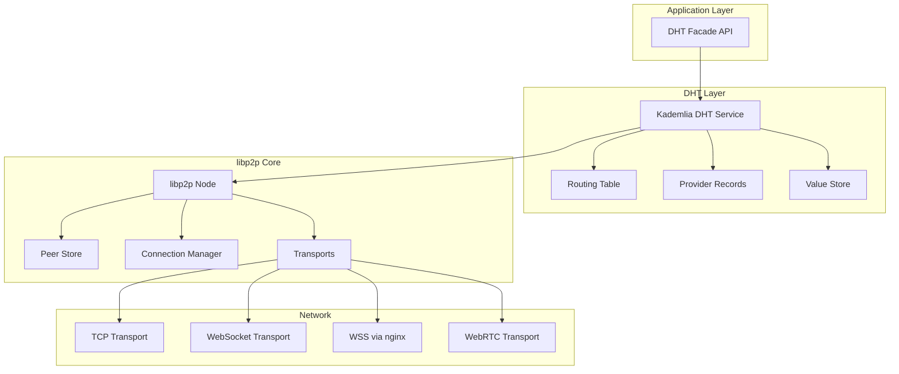
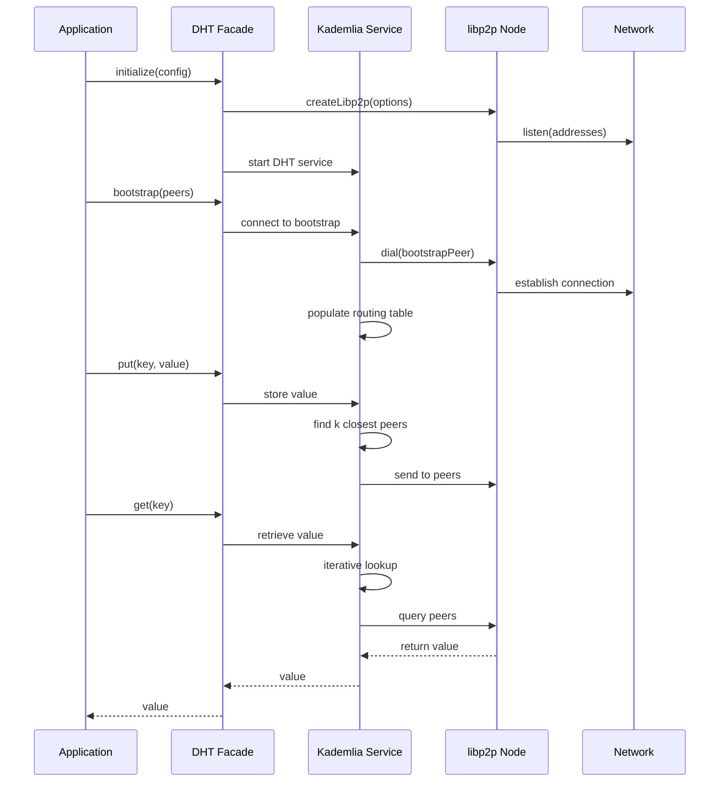

# Design Document: Kademlia DHT with libp2p

## Overview

This design describes a Kademlia DHT implementation using js-libp2p (the JavaScript/TypeScript implementation of libp2p). The system provides peer discovery, content routing, and distributed key-value storage capabilities. The implementation uses the `@libp2p/kad-dht` package as the core DHT module, with a custom wrapper layer for configuration, testing, and oracle-yz hardware deployment.

The architecture follows a modular approach where:
- Core libp2p node handles networking, identity, and transport
- Kademlia DHT service handles routing table, peer discovery, and content operations
- A facade layer provides a simplified API for application use
- Testing infrastructure validates correctness through property-based and unit tests

## Architecture



### Component Interaction Flow



## Components and Interfaces

### 1. DHTNode (Main Facade)

The primary interface for interacting with the DHT system.

```typescript
interface DHTNodeConfig {
  // Identity
  privateKey?: Uint8Array;
  
  // Network
  listenAddresses: string[];
  announceAddresses?: string[];
  
  // DHT Configuration
  kBucketSize?: number;        // Default: 20
  alpha?: number;              // Concurrency parameter, Default: 3
  protocol?: string;           // DHT protocol identifier
  clientMode?: boolean;        // Whether to run in client-only mode
  
  // Timeouts and Intervals
  refreshInterval?: number;    // Routing table refresh interval (ms)
  recordExpiration?: number;   // How long records live (ms)
  providerExpiration?: number; // How long provider records live (ms)
  
  // Connection Management
  maxConnections?: number;
  minConnections?: number;
  
  // Bootstrap
  bootstrapPeers?: string[];
  
  // WebRTC Configuration
  webrtc?: {
    enabled: boolean;
    stunServers?: string[];    // e.g., ['stun:stun.l.google.com:19302']
    turnServers?: {
      urls: string[];
      username?: string;
      credential?: string;
    }[];
  };
  
  // Circuit Relay (for NAT traversal)
  circuitRelay?: {
    enabled: boolean;
    reservationTTL?: number;   // How long to keep relay reservations (ms)
  };
}

interface DHTNode {
  // Lifecycle
  start(): Promise<void>;
  stop(): Promise<void>;
  
  // Identity
  peerId: PeerId;
  multiaddrs: Multiaddr[];
  
  // Bootstrap
  bootstrap(peers?: string[]): Promise<void>;
  
  // Peer Operations
  findPeer(peerId: PeerId): Promise<PeerInfo>;
  getClosestPeers(key: Uint8Array): AsyncIterable<PeerInfo>;
  
  // Content Operations
  put(key: Uint8Array, value: Uint8Array): Promise<void>;
  get(key: Uint8Array): Promise<Uint8Array>;
  
  // Provider Operations
  provide(key: CID): Promise<void>;
  findProviders(key: CID): AsyncIterable<PeerInfo>;
  
  // Events
  on(event: 'peer:connect', handler: (peerId: PeerId) => void): void;
  on(event: 'peer:disconnect', handler: (peerId: PeerId) => void): void;
  on(event: 'dht:routing:refresh', handler: () => void): void;
  
  // Diagnostics
  getRoutingTableInfo(): RoutingTableInfo;
}
```

### 2. RoutingTable Interface

Exposes routing table state for diagnostics and testing.

```typescript
interface RoutingTableInfo {
  localPeerId: string;
  buckets: BucketInfo[];
  totalPeers: number;
}

interface BucketInfo {
  index: number;
  peers: PeerInfo[];
  lastRefresh: Date;
}

interface PeerInfo {
  id: PeerId;
  multiaddrs: Multiaddr[];
  latency?: number;
  lastSeen?: Date;
}
```

### 3. Configuration Builder

Fluent API for building node configurations.

```typescript
class DHTConfigBuilder {
  static create(): DHTConfigBuilder;
  
  withListenAddresses(addresses: string[]): this;
  withBootstrapPeers(peers: string[]): this;
  withKBucketSize(k: number): this;
  withAlpha(alpha: number): this;
  withRefreshInterval(ms: number): this;
  withMaxConnections(max: number): this;
  withWebRTC(stunServers?: string[], turnServers?: TurnServer[]): this;
  withCircuitRelay(enabled: boolean): this;
  forOracleYZ(): this;  // Apply oracle-yz specific optimizations (WSS via imeyouwe.com)
  forBrowser(): this;   // Configure for browser environment (WebRTC + WSS)
  
  build(): DHTNodeConfig;
}
```

### 4. Internal Components

#### libp2p Node Factory

```typescript
interface LibP2PFactory {
  createNode(config: DHTNodeConfig): Promise<Libp2p>;
}
```

#### DHT Operations Handler

```typescript
interface DHTOperations {
  // Core DHT operations with retry logic
  putWithRetry(key: Uint8Array, value: Uint8Array, options?: RetryOptions): Promise<void>;
  getWithRetry(key: Uint8Array, options?: RetryOptions): Promise<Uint8Array | null>;
  
  // Iterative lookup implementation
  iterativeFindNode(targetId: Uint8Array): AsyncIterable<PeerInfo>;
  iterativeFindValue(key: Uint8Array): AsyncIterable<Uint8Array | PeerInfo>;
}

interface RetryOptions {
  maxRetries?: number;
  backoffMs?: number;
  timeoutMs?: number;
}
```

## Data Models

### Key Types

```typescript
// Peer identifier (cryptographic hash of public key)
type PeerId = {
  toString(): string;
  toBytes(): Uint8Array;
  equals(other: PeerId): boolean;
};

// Content identifier for provider records
type CID = {
  toString(): string;
  toBytes(): Uint8Array;
  multihash: Uint8Array;
};

// Network address
type Multiaddr = {
  toString(): string;
  toBytes(): Uint8Array;
  protocols(): Protocol[];
};
```

### DHT Records

```typescript
interface DHTRecord {
  key: Uint8Array;
  value: Uint8Array;
  timeReceived: Date;
  expiration?: Date;
}

interface ProviderRecord {
  cid: CID;
  provider: PeerId;
  multiaddrs: Multiaddr[];
  expiration: Date;
}
```

### XOR Distance Calculation

The Kademlia protocol uses XOR distance for routing decisions:

```typescript
// XOR distance between two keys/peer IDs
function xorDistance(a: Uint8Array, b: Uint8Array): Uint8Array {
  const result = new Uint8Array(Math.max(a.length, b.length));
  for (let i = 0; i < result.length; i++) {
    result[i] = (a[i] || 0) ^ (b[i] || 0);
  }
  return result;
}

// Compare distances (returns -1, 0, or 1)
function compareDistance(a: Uint8Array, b: Uint8Array): number;

// Get bucket index for a peer (based on leading zeros in XOR distance)
function getBucketIndex(localId: Uint8Array, peerId: Uint8Array): number;
```

### Configuration Serialization

```typescript
// Configuration can be serialized to/from JSON for persistence
interface SerializedConfig {
  listenAddresses: string[];
  bootstrapPeers: string[];
  kBucketSize: number;
  alpha: number;
  refreshInterval: number;
  maxConnections: number;
}

function serializeConfig(config: DHTNodeConfig): SerializedConfig;
function deserializeConfig(json: SerializedConfig): DHTNodeConfig;
```

## Correctness Properties

*A property is a characteristic or behavior that should hold true across all valid executions of a system—essentially, a formal statement about what the system should do. Properties serve as the bridge between human-readable specifications and machine-verifiable correctness guarantees.*

### Property 1: XOR Distance Symmetry

*For any* two peer IDs `a` and `b`, the XOR distance from `a` to `b` equals the XOR distance from `b` to `a`.

**Validates: Requirements 3.4**

### Property 2: Bucket Index Consistency

*For any* local peer ID and remote peer ID, the bucket index calculation is deterministic and falls within valid range [0, 255].

**Validates: Requirements 3.4**

### Property 3: Configuration Round-Trip

*For any* valid DHTNodeConfig, serializing then deserializing produces an equivalent configuration.

**Validates: Requirements 8.1, 8.2, 8.3, 8.4**

### Property 4: Closest Peers Ordering

*For any* target key and set of peers, the `getClosestPeers` operation returns peers ordered by ascending XOR distance to the target.

**Validates: Requirements 3.1, 3.5**

### Property 5: K-Bucket Size Invariant

*For any* routing table state, each k-bucket contains at most `k` peers (where `k` is the configured bucket size).

**Validates: Requirements 3.4, 8.1**

### Property 6: Put-Get Consistency

*For any* key-value pair that is successfully stored via `put`, a subsequent `get` with the same key returns the stored value (within the same node, before expiration).

**Validates: Requirements 4.1, 4.2**

### Property 7: Provider Record Round-Trip

*For any* CID that a node provides via `provide`, the node appears in the results of `findProviders` for that CID (within expiration window).

**Validates: Requirements 5.1, 5.2**

### Error Types

```typescript
enum DHTErrorCode {
  // Initialization errors
  INVALID_CONFIG = 'INVALID_CONFIG',
  KEY_GENERATION_FAILED = 'KEY_GENERATION_FAILED',
  
  // Network errors
  BOOTSTRAP_FAILED = 'BOOTSTRAP_FAILED',
  CONNECTION_FAILED = 'CONNECTION_FAILED',
  DIAL_FAILED = 'DIAL_FAILED',
  TIMEOUT = 'TIMEOUT',
  
  // DHT operation errors
  NOT_FOUND = 'NOT_FOUND',
  PUT_FAILED = 'PUT_FAILED',
  INVALID_RECORD = 'INVALID_RECORD',
  
  // Provider errors
  PROVIDE_FAILED = 'PROVIDE_FAILED',
  NO_PROVIDERS = 'NO_PROVIDERS',
}

class DHTError extends Error {
  code: DHTErrorCode;
  cause?: Error;
  context?: Record<string, unknown>;
}
```

### Error Handling Strategy

1. **Configuration Errors**: Validate all configuration at startup, fail fast with descriptive messages
2. **Network Errors**: Implement exponential backoff retry for transient failures
3. **DHT Operation Errors**: Return typed errors that callers can handle appropriately
4. **Bootstrap Failures**: Allow partial success (some bootstrap nodes reachable)

### Retry Policy

```typescript
const DEFAULT_RETRY_POLICY = {
  maxRetries: 3,
  initialBackoffMs: 100,
  maxBackoffMs: 5000,
  backoffMultiplier: 2,
};
```

## Testing Strategy

### Testing Framework

- **Test Runner**: Vitest (fast, TypeScript-native)
- **Property-Based Testing**: fast-check
- **Mocking**: Vitest built-in mocks for network isolation

### Test Categories

#### 1. Unit Tests

Unit tests verify individual components in isolation:

- XOR distance calculations
- Bucket index calculations
- Configuration validation
- Configuration serialization/deserialization
- Error handling paths

#### 2. Property-Based Tests

Property tests verify universal properties across many generated inputs:

- XOR distance symmetry (Property 1)
- Bucket index consistency (Property 2)
- Configuration round-trip (Property 3)
- Closest peers ordering (Property 4)
- K-bucket size invariant (Property 5)
- Put-Get consistency (Property 6)
- Provider record round-trip (Property 7)

Each property test runs minimum 100 iterations with randomly generated inputs.

#### 3. Integration Tests

Integration tests verify multi-component interactions:

- Node initialization and startup
- Bootstrap and network join
- Put/Get operations between nodes
- Provider record publishing and discovery
- Connection management and reconnection

### Test Configuration

```typescript
// Property test configuration
const PROPERTY_TEST_CONFIG = {
  numRuns: 100,
  seed: undefined,  // Random seed for reproducibility when debugging
  verbose: false,
};

// Integration test network
const TEST_NETWORK_CONFIG = {
  numNodes: 3,
  bootstrapDelay: 100,  // ms between node starts
  operationTimeout: 5000,  // ms for DHT operations
};
```

### Test File Structure

```
src/
├── dht/
│   ├── node.ts
│   ├── node.test.ts           # Unit tests
│   ├── node.property.test.ts  # Property tests
│   ├── config.ts
│   ├── config.test.ts
│   ├── distance.ts
│   ├── distance.test.ts
│   └── distance.property.test.ts
├── integration/
│   └── dht.integration.test.ts
└── test-utils/
    ├── generators.ts          # fast-check generators
    └── network.ts             # Test network helpers
```