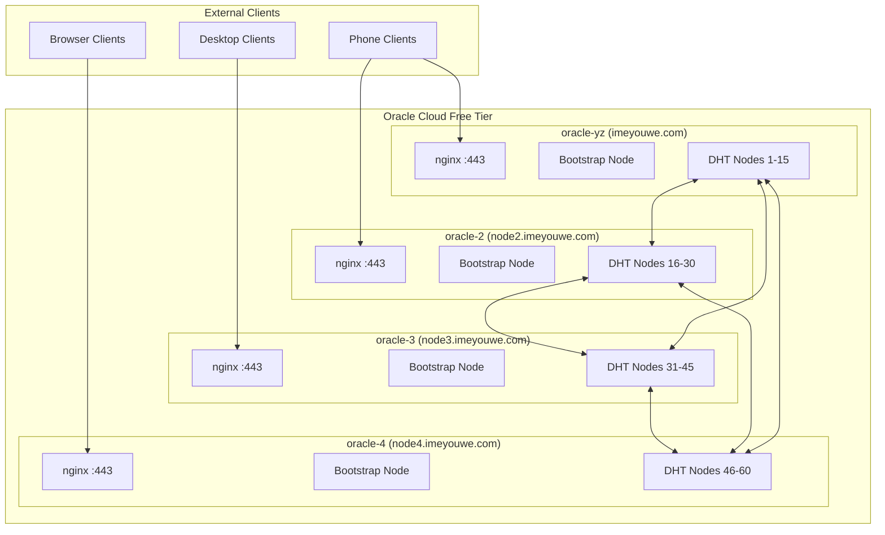
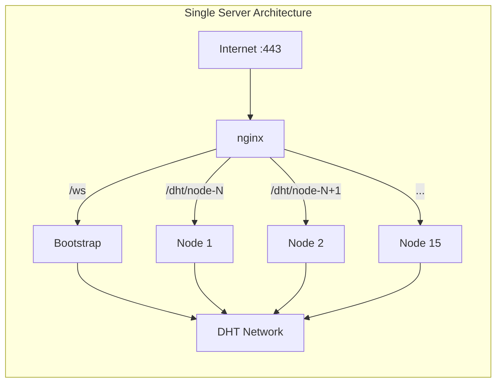

# Design Document: Multi-Server DHT Infrastructure

## Overview

This design describes how to scale the DHT network across 4 Oracle Cloud Free Tier ARM instances, distributing 60 DHT nodes (15 per server) while maintaining a unified mesh network. Each server operates independently with its own nginx, Docker containers, and SSL certificates, but all nodes participate in a single DHT network through cross-server bootstrap configuration.

## Architecture

### Network Topology



### Server Configuration

Each server follows the same architecture pattern:



## Components

### 1. Server Provisioning

Each Oracle Cloud instance requires:

```yaml
# Instance Configuration
shape: VM.Standard.A1.Flex
ocpus: 1
memory_gb: 6
boot_volume_gb: 47  # Default free tier
os: Ubuntu 22.04 (aarch64)

# Network Configuration
ports:
  - 22    # SSH
  - 80    # HTTP (certbot)
  - 443   # HTTPS/WSS
  - 4001  # libp2p (internal)
```

### 2. DNS Configuration

```
# DNS Records (Cloudflare or similar)
imeyouwe.com        A    <oracle-yz-ip>
node2.imeyouwe.com  A    <oracle-2-ip>
node3.imeyouwe.com  A    <oracle-3-ip>
node4.imeyouwe.com  A    <oracle-4-ip>
```

### 3. SSL Certificate Strategy

**Option A: Wildcard Certificate (Recommended)**
- Single wildcard cert for `*.imeyouwe.com`
- Copy to all servers
- Simpler renewal management

**Option B: Individual Certificates**
- Each server runs certbot independently
- More complex but no cert distribution needed

```bash
# Wildcard cert with DNS challenge
certbot certonly --dns-cloudflare \
  -d imeyouwe.com \
  -d "*.imeyouwe.com"
```

### 4. Cross-Server Bootstrap Configuration

Each server's nodes need bootstrap addresses from ALL servers:

```typescript
// src/cli/node.ts - Bootstrap configuration
const CROSS_SERVER_BOOTSTRAPS = [
  // Primary server (oracle-yz)
  '/dns4/imeyouwe.com/tcp/443/wss/ws',
  // Secondary servers
  '/dns4/node2.imeyouwe.com/tcp/443/wss/ws',
  '/dns4/node3.imeyouwe.com/tcp/443/wss/ws',
  '/dns4/node4.imeyouwe.com/tcp/443/wss/ws',
];

// Filter out self to avoid self-connection
const bootstrapAddresses = CROSS_SERVER_BOOTSTRAPS.filter(
  addr => !addr.includes(EXTERNAL_HOST)
);
```

### 5. Global Node Indexing

```typescript
// Environment variables per server
SERVER_INDEX=1        // 1, 2, 3, or 4
NODES_PER_SERVER=15
EXTERNAL_HOST=imeyouwe.com  // or node2.imeyouwe.com, etc.

// Calculate global node index
const globalIndex = (SERVER_INDEX - 1) * NODES_PER_SERVER + localIndex;
// Server 1: nodes 1-15
// Server 2: nodes 16-30
// Server 3: nodes 31-45
// Server 4: nodes 46-60
```

### 6. Deployment Script

```bash
#!/bin/bash
# scripts/deploy-server.sh

SERVER_INDEX=${1:-1}
NODES_PER_SERVER=${2:-15}

# Server-specific configuration
case $SERVER_INDEX in
  1) EXTERNAL_HOST="imeyouwe.com" ;;
  2) EXTERNAL_HOST="node2.imeyouwe.com" ;;
  3) EXTERNAL_HOST="node3.imeyouwe.com" ;;
  4) EXTERNAL_HOST="node4.imeyouwe.com" ;;
esac

# Export for docker-compose
export SERVER_INDEX
export NODES_PER_SERVER
export EXTERNAL_HOST

# Generate nginx config
./scripts/generate-nginx-config.sh $NODES_PER_SERVER $SERVER_INDEX

# Start services
docker-compose up -d --scale dht-node=$NODES_PER_SERVER
```

### 7. Docker Compose Updates

```yaml
# docker-compose.yml
version: '3.8'

services:
  bootstrap:
    build: .
    container_name: libp2p-bootstrap
    command: ["node", "dist/cli/ws-bridge.js"]
    environment:
      - NODE_ID=bootstrap
      - IS_BOOTSTRAP=true
      - EXTERNAL_HOST=${EXTERNAL_HOST:-imeyouwe.com}
      - SERVER_INDEX=${SERVER_INDEX:-1}
      - CROSS_SERVER_BOOTSTRAPS=wss://imeyouwe.com/ws,wss://node2.imeyouwe.com/ws,wss://node3.imeyouwe.com/ws,wss://node4.imeyouwe.com/ws
    networks:
      - dht-network

  dht-node:
    build: .
    command: ["node", "dist/cli/node.js"]
    environment:
      - EXTERNAL_HOST=${EXTERNAL_HOST:-imeyouwe.com}
      - SERVER_INDEX=${SERVER_INDEX:-1}
      - NODES_PER_SERVER=${NODES_PER_SERVER:-15}
      - CROSS_SERVER_BOOTSTRAPS=wss://imeyouwe.com/ws,wss://node2.imeyouwe.com/ws,wss://node3.imeyouwe.com/ws,wss://node4.imeyouwe.com/ws
    networks:
      - dht-network
    deploy:
      replicas: ${NODES_PER_SERVER:-15}

  webserver:
    image: nginx:alpine
    ports:
      - "80:80"
      - "443:443"
    volumes:
      - ./nginx/nginx.conf:/etc/nginx/conf.d/default.conf:ro
      - ./nginx/dht-nodes.conf:/etc/nginx/conf.d/dht-nodes.conf:ro
      - /etc/letsencrypt:/etc/letsencrypt:ro
    networks:
      - dht-network

networks:
  dht-network:
    driver: bridge
```

## Data Models

### Server Configuration

```typescript
interface ServerConfig {
  serverIndex: number;        // 1-4
  externalHost: string;       // e.g., "node2.imeyouwe.com"
  nodesPerServer: number;     // 15
  globalIndexOffset: number;  // (serverIndex - 1) * nodesPerServer
  bootstrapAddresses: string[];
}

interface NodeConfig {
  localIndex: number;         // 1-15 within server
  globalIndex: number;        // 1-60 across all servers
  publicPath: string;         // /dht/node-{globalIndex}
  announceAddress: string;    // /dns4/{host}/tcp/443/wss/dht/node-{globalIndex}
}
```

### Health Status

```typescript
interface ServerHealth {
  serverIndex: number;
  hostname: string;
  status: 'healthy' | 'degraded' | 'offline';
  nodeCount: number;
  activeConnections: number;
  lastSeen: Date;
}

interface NetworkHealth {
  servers: ServerHealth[];
  totalNodes: number;
  totalConnections: number;
  replicationFactor: number;
}
```

## Data Replication Strategy

### Kademlia Replication

libp2p's kad-dht handles replication automatically:

```typescript
// DHT configuration for replication
const dhtConfig = {
  kBucketSize: 20,           // K parameter
  // Data is stored on K closest nodes
  // When nodes leave, remaining nodes re-replicate
};
```

### Republish Mechanism

```typescript
// Periodic republish ensures data survives node churn
const REPUBLISH_INTERVAL = 60 * 60 * 1000; // 1 hour

// Each node periodically republishes its stored data
// This ensures data migrates to new closest nodes as topology changes
```

### Provider Records

```typescript
// Provider records (who has what content) are also replicated
// kad-dht automatically refreshes provider records every 12 hours
```


## Correctness Properties

*A property is a characteristic or behavior that should hold true across all valid executions of a system—essentially, a formal statement about what the system should do. Properties serve as the bridge between human-readable specifications and machine-verifiable correctness guarantees.*

### Property 1: Global Index Uniqueness

*For any* two nodes in the network, their global indices SHALL be unique and non-overlapping.

**Validates: Requirements 6.1, 6.2, 6.3**

### Property 2: Cross-Server Connectivity

*For any* node on server A, it SHALL be able to discover and connect to nodes on servers B, C, and D through the DHT.

**Validates: Requirements 5.1, 5.2, 5.3**

### Property 3: Data Replication Invariant

*For any* key-value pair stored in the DHT, it SHALL be replicated on at least K nodes (where K is the replication factor), regardless of which server originally stored it.

**Validates: Requirements 8.5, 8.6, 8.7**

### Property 4: Server Failure Resilience

*For any* server that goes offline, the remaining servers SHALL continue to serve all previously stored data (assuming replication factor > 1 and data was replicated across servers).

**Validates: Requirements 8.1, 8.4, 8.7**

### Property 5: Bootstrap Convergence

*For any* new client connecting to any server's bootstrap node, it SHALL eventually discover nodes from all online servers.

**Validates: Requirements 5.2, 5.4**

## Error Handling

### Server Unreachable

```typescript
// When a cross-server bootstrap fails
try {
  await node.dial(bootstrapAddr);
} catch (error) {
  console.warn(`Bootstrap ${bootstrapAddr} unreachable, trying next...`);
  // Continue with other bootstraps
}
```

### Certificate Expiry

```typescript
// Certbot auto-renewal with pre/post hooks
// /etc/letsencrypt/renewal-hooks/deploy/restart-nginx.sh
#!/bin/bash
docker exec webserver nginx -s reload
```

### Node Index Collision

```typescript
// Validate global index on startup
function validateGlobalIndex(serverIndex: number, localIndex: number): number {
  if (serverIndex < 1 || serverIndex > 4) {
    throw new Error(`Invalid server index: ${serverIndex}`);
  }
  if (localIndex < 1 || localIndex > NODES_PER_SERVER) {
    throw new Error(`Invalid local index: ${localIndex}`);
  }
  return (serverIndex - 1) * NODES_PER_SERVER + localIndex;
}
```

## Testing Strategy

### Unit Tests

- Global index calculation
- Bootstrap address filtering (exclude self)
- Server configuration validation

### Integration Tests

- Cross-server node discovery
- Data replication across servers
- Server failure and recovery

### Manual Validation

```bash
# Test cross-server connectivity
curl -s https://imeyouwe.com/bootstrap/info | jq '.routingTable'
curl -s https://node2.imeyouwe.com/bootstrap/info | jq '.routingTable'

# Verify nodes from all servers appear in routing tables
# Should see nodes with global indices 1-60

# Test data replication
# Store on server 1, retrieve from server 2
curl -X POST https://imeyouwe.com/dht/put -d '{"key":"test","value":"hello"}'
curl https://node2.imeyouwe.com/dht/get?key=test
```

## Deployment Sequence

### Phase 1: Provision Instances

1. Create oracle-2, oracle-3, oracle-4 in OCI console
2. Configure security lists (ports 22, 80, 443)
3. Set up SSH access

### Phase 2: DNS and SSL

1. Add DNS records for subdomains
2. Generate wildcard SSL certificate
3. Distribute certificate to all servers

### Phase 3: Deploy Primary (oracle-yz)

1. Update code with cross-server bootstrap config
2. Deploy with 15 nodes
3. Verify local functionality

### Phase 4: Deploy Secondary Servers

1. Clone repo to each server
2. Run deployment script with server index
3. Verify cross-server connectivity

### Phase 5: Validation

1. Test DHT queries return nodes from all servers
2. Test data replication across servers
3. Test server failure scenarios

## Rollback Plan

```bash
# If issues arise, scale back to single server
# On secondary servers:
docker-compose down

# On primary server:
# Revert to single-server bootstrap config
git checkout src/cli/node.ts
docker-compose down && docker-compose up -d
```
