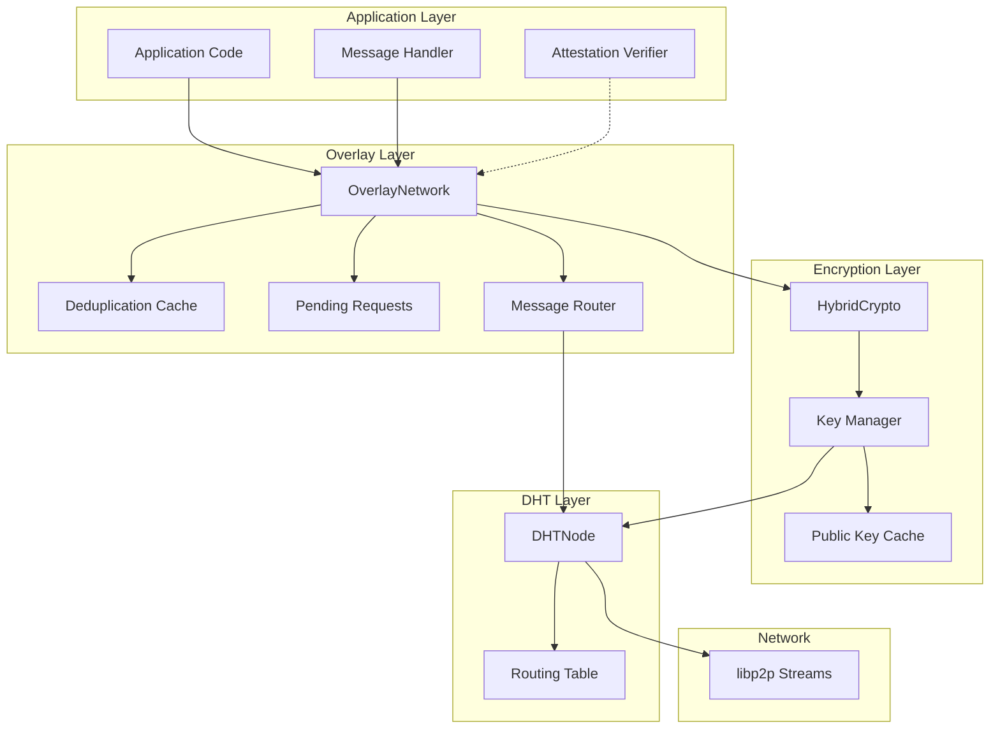
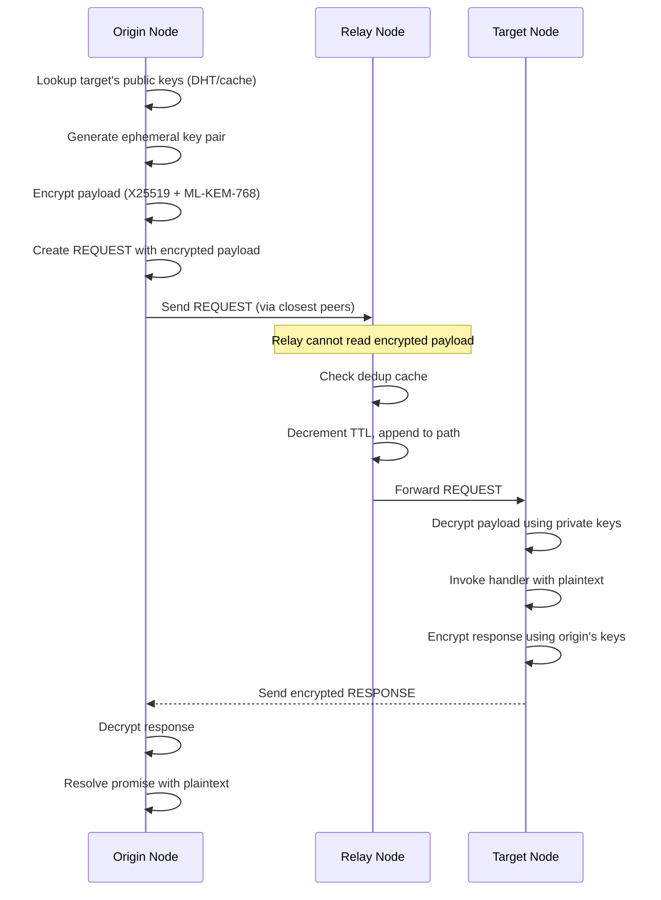
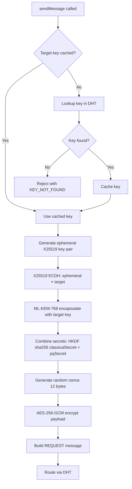
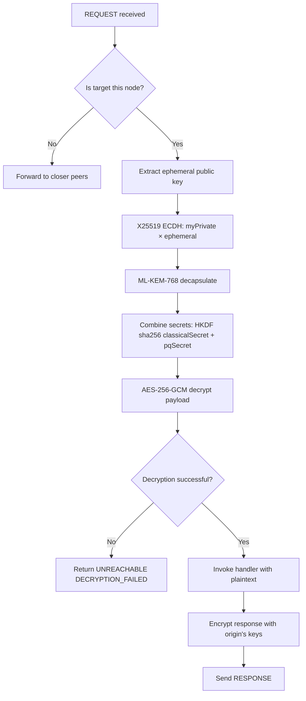
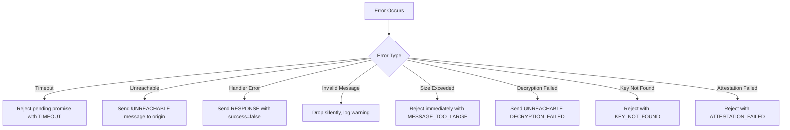

# Design Document: Overlay Messaging Network

## Overview

This design describes an overlay messaging network built on top of the existing Kademlia DHT implementation. The overlay enables request-response messaging between specific nodes, with message deduplication to prevent flooding, DHT-based routing for message delivery, and hybrid post-quantum end-to-end encryption for payload confidentiality.

The architecture follows a layered approach where:
- The existing DHT layer handles peer discovery and routing table management
- The overlay layer adds message handling, deduplication, and request-response semantics
- The encryption layer provides hybrid post-quantum E2E encryption (X25519 + ML-KEM-768)
- A wire protocol defines message serialization for network transmission
- Event handlers allow applications to process incoming messages
- Optional attestation hooks enable future code verification



### Encrypted Message Flow



## Architecture

### Component Responsibilities

1. **OverlayNetwork**: Main facade providing `sendMessage()` and `onMessage()` APIs
2. **MessageRouter**: Routes messages using DHT routing table, handles forwarding
3. **DeduplicationCache**: Time-limited cache preventing duplicate message processing
4. **PendingRequests**: Tracks outgoing requests awaiting responses, handles timeouts
5. **HybridCrypto**: Handles hybrid post-quantum encryption/decryption
6. **KeyManager**: Manages key generation, storage, and DHT publication
7. **PublicKeyCache**: Caches discovered public keys with TTL
8. **WireProtocol**: Serializes/deserializes messages for network transmission
9. **AttestationVerifier** (Optional): Validates node code attestations

### Integration with DHT

The overlay network integrates with the existing DHTNode:
- Uses `getClosestPeers()` to find routing paths to targets
- Registers a custom libp2p protocol handler for overlay messages
- Leverages existing connection management and peer discovery
- Extends DHTNodeConfig with overlay-specific options
- Publishes and retrieves public keys via DHT `put()`/`get()`

## Components and Interfaces

### 1. OverlayNetwork (Main Facade)

```typescript
interface OverlayConfig {
  maxMessageSize?: number;      // Default: 65536 (64KB)
  defaultTTL?: number;          // Default: 20 (based on network size)
  dedupeWindowMs?: number;      // Default: 60000 (1 minute)
  defaultRedundancy?: number;   // Default: 3
  responseTimeout?: number;     // Default: 30000 (30 seconds)
  encryption?: EncryptionConfig;
  attestation?: AttestationConfig;
}

interface EncryptionConfig {
  enabled?: boolean;            // Default: true
  keyPublishInterval?: number;  // Default: 3600000 (1 hour)
  keyCacheTTL?: number;         // Default: 300000 (5 minutes)
}

interface AttestationConfig {
  enabled?: boolean;            // Default: false
  verifier?: AttestationVerifier;
  handlerCodeHash?: string;     // SHA-256 hash of handler code
}

interface SendOptions {
  timeout?: number;             // Override default timeout
  redundancy?: number;          // Override default redundancy
  ttl?: number;                 // Override default TTL
  requireAttestation?: boolean; // Require target attestation (if enabled)
}

interface MessageContext {
  originPeerId: string;
  messageId: string;
}

type MessageHandler = (
  payload: Uint8Array,
  context: MessageContext
) => Promise<Uint8Array> | Uint8Array;

interface OverlayNetwork {
  // Lifecycle
  start(): Promise<void>;
  stop(): Promise<void>;
  
  // Messaging
  sendMessage(
    targetPeerId: string,
    payload: Uint8Array,
    options?: SendOptions
  ): Promise<Uint8Array>;
  
  // Handler registration
  onMessage(handler: MessageHandler): void;
  offMessage(): void;
  
  // Key management
  getPublicKeys(): HybridPublicKey;
  
  // Attestation (optional)
  setAttestationVerifier(verifier: AttestationVerifier): void;
  
  // Access to underlying DHT
  readonly dht: DHTNode;
  readonly peerId: string;
}
```

### 2. Hybrid Crypto (Post-Quantum Encryption)

```typescript
interface HybridPublicKey {
  x25519: Uint8Array;           // 32 bytes - classical ECDH
  mlkem768: Uint8Array;         // 1184 bytes - post-quantum KEM
}

interface HybridPrivateKey {
  x25519: Uint8Array;           // 32 bytes
  mlkem768: Uint8Array;         // 2400 bytes
}

interface HybridKeyPair {
  publicKey: HybridPublicKey;
  privateKey: HybridPrivateKey;
}

interface EncryptedPayload {
  ephemeralX25519: Uint8Array;  // 32 bytes - ephemeral public key
  mlkemCiphertext: Uint8Array;  // 1088 bytes - ML-KEM encapsulation
  nonce: Uint8Array;            // 12 bytes - AES-GCM nonce
  ciphertext: Uint8Array;       // variable - encrypted payload
  authTag: Uint8Array;          // 16 bytes - AES-GCM auth tag
}

interface HybridCrypto {
  // Key generation
  generateKeyPair(): Promise<HybridKeyPair>;
  
  // Encryption (for sending)
  encrypt(
    plaintext: Uint8Array,
    recipientPublicKey: HybridPublicKey
  ): Promise<EncryptedPayload>;
  
  // Decryption (for receiving)
  decrypt(
    encrypted: EncryptedPayload,
    privateKey: HybridPrivateKey
  ): Promise<Uint8Array>;
  
  // Serialize/deserialize keys
  serializePublicKey(key: HybridPublicKey): Uint8Array;
  deserializePublicKey(data: Uint8Array): HybridPublicKey;
}
```

### 3. Key Manager

```typescript
interface KeyManager {
  // Initialize with existing keys or generate new ones
  initialize(existingKeys?: HybridKeyPair): Promise<void>;
  
  // Get this node's keys
  getKeyPair(): HybridKeyPair;
  getPublicKey(): HybridPublicKey;
  
  // Publish public key to DHT
  publishPublicKey(): Promise<void>;
  
  // Lookup a peer's public key
  lookupPublicKey(peerId: string): Promise<HybridPublicKey>;
  
  // Key rotation
  rotateKeys(): Promise<void>;
}

interface PublicKeyCache {
  // Get cached key (returns undefined if not cached or expired)
  get(peerId: string): HybridPublicKey | undefined;
  
  // Cache a key with TTL
  set(peerId: string, key: HybridPublicKey): void;
  
  // Invalidate a cached key
  invalidate(peerId: string): void;
  
  // Clean expired entries
  cleanup(): void;
}
```

### 4. Message Router

```typescript
interface RouteResult {
  delivered: boolean;
  nextHops?: string[];
  error?: OverlayError;
}

interface MessageRouter {
  // Route a message toward target
  routeMessage(message: RequestMessage): Promise<RouteResult>;
  
  // Route a response back to origin
  routeResponse(response: ResponseMessage): Promise<void>;
  
  // Get next hops for a target (uses DHT routing)
  getNextHops(targetPeerId: string, count: number): Promise<string[]>;
}
```

### 5. Deduplication Cache

```typescript
interface DeduplicationEntry {
  messageId: string;
  timestamp: number;
  forwardedTo: string[];
}

interface DeduplicationCache {
  // Check if message was seen, returns true if duplicate
  isDuplicate(messageId: string): boolean;
  
  // Record a message as seen
  record(messageId: string, forwardedTo: string[]): void;
  
  // Get peers a message was forwarded to
  getForwardedPeers(messageId: string): string[] | undefined;
  
  // Clean expired entries
  cleanup(): void;
  
  // Get cache statistics
  getStats(): { size: number; oldestEntry: number };
}
```

### 6. Pending Requests Manager

```typescript
interface PendingRequest {
  messageId: string;
  targetPeerId: string;
  timestamp: number;
  timeout: number;
  resolve: (response: Uint8Array) => void;
  reject: (error: OverlayError) => void;
}

interface PendingRequestsManager {
  // Register a pending request
  register(request: PendingRequest): void;
  
  // Resolve a pending request with response
  resolve(messageId: string, response: Uint8Array): boolean;
  
  // Reject a pending request with error
  reject(messageId: string, error: OverlayError): boolean;
  
  // Check for timed out requests
  checkTimeouts(): void;
  
  // Get pending request count
  getPendingCount(): number;
}
```

### 7. Attestation Verifier (Optional/Future)

```typescript
interface NodeAttestation {
  peerId: string;
  handlerCodeHash: string;      // SHA-256 of handler code
  timestamp: number;
  signature: Uint8Array;        // Signed by node's identity key
  
  // Future: TEE attestation fields
  teeType?: 'sgx' | 'nitro' | 'sev';
  teeAttestation?: Uint8Array;
}

interface AttestationVerifier {
  // Verify a node's attestation
  verify(attestation: NodeAttestation): Promise<AttestationResult>;
  
  // Check if a code hash is trusted
  isTrustedCodeHash(hash: string): boolean;
  
  // Add a trusted code hash
  addTrustedCodeHash(hash: string): void;
  
  // Remove a trusted code hash
  removeTrustedCodeHash(hash: string): void;
}

interface AttestationResult {
  valid: boolean;
  reason?: string;
  trustedCode?: boolean;
}

// Default implementation that accepts all attestations
class NoOpAttestationVerifier implements AttestationVerifier {
  async verify(): Promise<AttestationResult> {
    return { valid: true };
  }
  isTrustedCodeHash(): boolean { return true; }
  addTrustedCodeHash(): void {}
  removeTrustedCodeHash(): void {}
}
```

### 8. Wire Protocol Handler

```typescript
interface WireProtocol {
  // Protocol identifier for libp2p
  readonly protocolId: string;
  
  // Serialize messages
  encodeRequest(message: RequestMessage): Uint8Array;
  encodeResponse(message: ResponseMessage): Uint8Array;
  encodeDuplicate(messageId: string): Uint8Array;
  encodeUnreachable(messageId: string, reason: UnreachableReason): Uint8Array;
  
  // Deserialize messages
  decode(data: Uint8Array): OverlayMessage;
  
  // Validate message size
  validateSize(data: Uint8Array, maxSize: number): boolean;
}
```

## Data Models

### Message Types

```typescript
enum MessageType {
  REQUEST = 0,
  RESPONSE = 1,
  DUPLICATE = 2,
  UNREACHABLE = 3,
}

enum UnreachableReason {
  TTL_EXPIRED = 0,
  TARGET_NOT_FOUND = 1,
  NO_ROUTE = 2,
  NO_HANDLER = 3,
  DECRYPTION_FAILED = 4,
  ATTESTATION_FAILED = 5,
}

interface RequestMessage {
  type: MessageType.REQUEST;
  messageId: string;              // UUID v4
  originPeerId: string;
  targetPeerId: string;
  ttl: number;
  timestamp: number;
  path: string[];                 // Peer IDs traversed
  
  // Encryption fields
  originPublicKey: HybridPublicKey;  // For response encryption
  encryptedPayload: EncryptedPayload;
  
  // Optional attestation request
  requestAttestation?: boolean;
}

interface ResponseMessage {
  type: MessageType.RESPONSE;
  messageId: string;
  originPeerId: string;           // Original requester
  targetPeerId: string;           // Original target (responder)
  path: string[];                 // Response path
  encryptedPayload: EncryptedPayload;
  success: boolean;
  errorMessage?: string;          // If success is false (not encrypted)
  
  // Optional attestation
  attestation?: NodeAttestation;
}

interface DuplicateMessage {
  type: MessageType.DUPLICATE;
  messageId: string;
}

interface UnreachableMessage {
  type: MessageType.UNREACHABLE;
  messageId: string;
  reason: UnreachableReason;
}

type OverlayMessage = 
  | RequestMessage 
  | ResponseMessage 
  | DuplicateMessage 
  | UnreachableMessage;
```

### Configuration Extension

```typescript
// Extends existing DHTNodeConfig
interface DHTNodeConfigWithOverlay extends DHTNodeConfig {
  overlay?: OverlayConfig;
}

// Default overlay configuration
const DEFAULT_OVERLAY_CONFIG: Required<OverlayConfig> = {
  maxMessageSize: 65536,        // 64KB
  defaultTTL: 20,               // ~covers networks up to 2^20 nodes
  dedupeWindowMs: 60000,        // 1 minute
  defaultRedundancy: 3,         // 3 parallel paths
  responseTimeout: 30000,       // 30 seconds
  encryption: {
    enabled: true,
    keyPublishInterval: 3600000, // 1 hour
    keyCacheTTL: 300000,        // 5 minutes
  },
  attestation: {
    enabled: false,             // Disabled by default
  },
};
```

### Error Types

```typescript
enum OverlayErrorCode {
  // Send errors
  TIMEOUT = 'TIMEOUT',
  UNREACHABLE = 'UNREACHABLE',
  MESSAGE_TOO_LARGE = 'MESSAGE_TOO_LARGE',
  
  // Receive errors
  NO_HANDLER = 'NO_HANDLER',
  HANDLER_ERROR = 'HANDLER_ERROR',
  
  // Protocol errors
  INVALID_MESSAGE = 'INVALID_MESSAGE',
  DUPLICATE = 'DUPLICATE',
  
  // Routing errors
  TTL_EXPIRED = 'TTL_EXPIRED',
  NO_ROUTE = 'NO_ROUTE',
  TARGET_NOT_FOUND = 'TARGET_NOT_FOUND',
  
  // Encryption errors
  DECRYPTION_FAILED = 'DECRYPTION_FAILED',
  KEY_NOT_FOUND = 'KEY_NOT_FOUND',
  
  // Attestation errors
  ATTESTATION_FAILED = 'ATTESTATION_FAILED',
  ATTESTATION_REQUIRED = 'ATTESTATION_REQUIRED',
}

class OverlayError extends Error {
  code: OverlayErrorCode;
  messageId?: string;
  cause?: Error;
  context?: Record<string, unknown>;
}
```

### Wire Format

Messages are serialized using a compact binary format:

```
+--------+----------+------------------+
| Header | Metadata | Encrypted Data   |
+--------+----------+------------------+
| 1 byte | variable | variable         |
+--------+----------+------------------+

Header byte:
  bits 0-1: message type (0=REQUEST, 1=RESPONSE, 2=DUPLICATE, 3=UNREACHABLE)
  bit 2: attestation requested (REQUEST) / attestation included (RESPONSE)
  bits 3-7: reserved

REQUEST metadata:
  - messageId: 16 bytes (UUID)
  - originPeerId: 2 bytes length + bytes
  - targetPeerId: 2 bytes length + bytes
  - ttl: 1 byte
  - timestamp: 8 bytes (uint64)
  - pathLength: 1 byte
  - path: pathLength * (2 bytes length + bytes)
  - originX25519PublicKey: 32 bytes
  - originMLKEMPublicKey: 1184 bytes
  - ephemeralX25519: 32 bytes
  - mlkemCiphertext: 1088 bytes
  - nonce: 12 bytes
  - ciphertextLength: 4 bytes
  - ciphertext: ciphertextLength bytes
  - authTag: 16 bytes

RESPONSE metadata:
  - messageId: 16 bytes (UUID)
  - originPeerId: 2 bytes length + bytes
  - targetPeerId: 2 bytes length + bytes
  - pathLength: 1 byte
  - path: pathLength * (2 bytes length + bytes)
  - success: 1 byte (0=false, 1=true)
  - errorMessageLength: 2 bytes (if success=0)
  - errorMessage: errorMessageLength bytes (if success=0)
  - ephemeralX25519: 32 bytes
  - mlkemCiphertext: 1088 bytes
  - nonce: 12 bytes
  - ciphertextLength: 4 bytes
  - ciphertext: ciphertextLength bytes
  - authTag: 16 bytes
  - attestationLength: 2 bytes (if attestation bit set)
  - attestation: attestationLength bytes (if attestation bit set)

DUPLICATE metadata:
  - messageId: 16 bytes (UUID)

UNREACHABLE metadata:
  - messageId: 16 bytes (UUID)
  - reason: 1 byte
```

### Public Key DHT Record

Public keys are stored in the DHT under a well-known key derived from the peer ID:

```typescript
// Key format: /overlay/pubkey/<peerId>
function getPublicKeyDHTKey(peerId: string): Uint8Array {
  return new TextEncoder().encode(`/overlay/pubkey/${peerId}`);
}

// Value format
interface PublicKeyRecord {
  peerId: string;
  x25519: Uint8Array;           // 32 bytes
  mlkem768: Uint8Array;         // 1184 bytes
  timestamp: number;
  signature: Uint8Array;        // Signed by node's identity key
}
```

## Encryption Flow

### Sending a Message



### Receiving a Message




## Correctness Properties

*A property is a characteristic or behavior that should hold true across all valid executions of a system—essentially, a formal statement about what the system should do. Properties serve as the bridge between human-readable specifications and machine-verifiable correctness guarantees.*

### Property 1: Encryption Round-Trip

*For any* valid plaintext payload, encrypting with a recipient's hybrid public key then decrypting with the corresponding private key produces the original plaintext.

**Validates: Requirements 9.1, 9.3, 9.4, 9.5, 9.7, 9.10**

### Property 2: Message Serialization Round-Trip

*For any* valid OverlayMessage (REQUEST, RESPONSE, DUPLICATE, or UNREACHABLE), encoding then decoding the message produces an equivalent message with all fields preserved.

**Validates: Requirements 6.1, 6.2, 6.3, 6.4, 6.6, 6.7**

### Property 3: Public Key DHT Round-Trip

*For any* valid HybridPublicKey, publishing to the DHT then looking up by peer ID returns an equivalent public key.

**Validates: Requirements 10.3, 10.4**

### Property 4: Ephemeral Keys Are Unique Per Message

*For any* two messages sent to the same target, the ephemeral X25519 public keys in the encrypted payloads are different.

**Validates: Requirements 9.2**

### Property 5: Deduplication Prevents Re-Forwarding

*For any* message ID that has been recorded in the deduplication cache, calling `isDuplicate()` with that message ID returns true, and the message is not forwarded again.

**Validates: Requirements 3.1, 3.2**

### Property 6: TTL Decrement on Forward

*For any* RequestMessage with TTL > 0 that is forwarded by a relay node, the forwarded message has TTL equal to the original TTL minus 1.

**Validates: Requirements 4.2**

### Property 7: Path Tracking on Forward

*For any* RequestMessage forwarded by a relay node, the forwarded message's path array contains the relay node's peer ID appended to the original path.

**Validates: Requirements 4.3**

### Property 8: First Response Wins

*For any* message ID with a pending request, when multiple responses arrive, only the first response resolves the promise; subsequent responses for the same message ID are ignored.

**Validates: Requirements 5.4**

### Property 9: Message Size Validation

*For any* message payload that exceeds the configured maxMessageSize, the sendMessage operation rejects with a MESSAGE_TOO_LARGE error before attempting to send.

**Validates: Requirements 6.5, 8.3**

### Property 10: Timeout Behavior

*For any* sendMessage call with a timeout option, if no response is received within the timeout period, the promise rejects with a TIMEOUT error containing the message ID.

**Validates: Requirements 1.3, 8.1**

### Property 11: Handler Invocation Context

*For any* RequestMessage that arrives at its target node with a registered handler, the handler is invoked with the correct originPeerId and decrypted payload from the message.

**Validates: Requirements 2.2**

### Property 12: Handler Error Propagation

*For any* handler that throws an error, the response message has success=false and includes the error message from the thrown error.

**Validates: Requirements 2.4, 8.4**

### Property 13: No Handler Error Response

*For any* RequestMessage that arrives at a target node with no registered handler, the response is an UNREACHABLE message with reason NO_HANDLER.

**Validates: Requirements 2.6**

### Property 14: Configuration Defaults Applied

*For any* OverlayNetwork created without explicit overlay configuration, the effective configuration uses the default values (maxMessageSize=64KB, defaultTTL=20, dedupeWindowMs=60000, defaultRedundancy=3, responseTimeout=30000, encryption.enabled=true).

**Validates: Requirements 7.7**

### Property 15: Deduplication Cache Expiration

*For any* message ID recorded in the deduplication cache, after the configured dedupeWindowMs has elapsed, the message ID is no longer in the cache (isDuplicate returns false).

**Validates: Requirements 3.4**

## Error Handling

### Error Handling Strategy

1. **Send Errors**: Validate message size before sending; reject immediately with typed errors
2. **Timeout Errors**: Use per-request timers; clean up pending request on timeout
3. **Routing Errors**: Propagate UNREACHABLE errors back to origin with specific reason
4. **Handler Errors**: Catch handler exceptions; wrap in error response with message
5. **Protocol Errors**: Drop invalid messages silently; log warning for debugging
6. **Encryption Errors**: Reject with DECRYPTION_FAILED if payload cannot be decrypted
7. **Key Errors**: Reject with KEY_NOT_FOUND if target's public key cannot be retrieved
8. **Attestation Errors**: Reject with ATTESTATION_FAILED if verification fails (when enabled)

### Error Response Flow



### Retry Policy

The overlay network does not implement automatic retries. Redundancy (sending via multiple paths) provides reliability. Applications can implement their own retry logic if needed.

## Testing Strategy

### Testing Framework

- **Test Runner**: Vitest (consistent with existing DHT tests)
- **Property-Based Testing**: fast-check
- **Mocking**: Vitest built-in mocks for network isolation
- **Crypto Libraries**: @noble/curves (X25519), @noble/post-quantum (ML-KEM-768)

### Test Categories

#### 1. Unit Tests

Unit tests verify individual components in isolation:

- Wire protocol encoding/decoding
- Hybrid encryption/decryption
- Key serialization/deserialization
- Deduplication cache operations
- Pending requests management
- Configuration validation
- Error type construction

#### 2. Property-Based Tests

Property tests verify universal properties across many generated inputs:

- Encryption round-trip (Property 1)
- Message serialization round-trip (Property 2)
- Public key DHT round-trip (Property 3)
- Ephemeral key uniqueness (Property 4)
- Deduplication behavior (Property 5)
- TTL decrement (Property 6)
- Path tracking (Property 7)
- First response wins (Property 8)
- Message size validation (Property 9)
- Timeout behavior (Property 10)
- Handler invocation (Property 11)
- Handler error propagation (Property 12)
- No handler error (Property 13)
- Configuration defaults (Property 14)
- Cache expiration (Property 15)

Each property test runs minimum 100 iterations with randomly generated inputs.

#### 3. Integration Tests

Integration tests verify multi-component interactions:

- End-to-end encrypted message sending between nodes
- Multi-hop routing through relay nodes
- Redundant path delivery
- Response routing (reverse path and DHT lookup)
- Deduplication across network
- Key publication and discovery via DHT

### Test Configuration

```typescript
// Property test configuration
const PROPERTY_TEST_CONFIG = {
  numRuns: 100,
  seed: undefined,
  verbose: false,
};

// Integration test network
const TEST_NETWORK_CONFIG = {
  numNodes: 5,
  messageTimeout: 5000,
  dedupeWindow: 1000,
};
```

### Test File Structure

```
src/
├── overlay/
│   ├── overlay.ts
│   ├── overlay.test.ts              # Unit tests
│   ├── overlay.property.test.ts     # Property tests
│   ├── wire-protocol.ts
│   ├── wire-protocol.test.ts
│   ├── wire-protocol.property.test.ts
│   ├── crypto.ts                    # Hybrid encryption
│   ├── crypto.test.ts
│   ├── crypto.property.test.ts
│   ├── key-manager.ts
│   ├── key-manager.test.ts
│   ├── dedup-cache.ts
│   ├── dedup-cache.test.ts
│   ├── dedup-cache.property.test.ts
│   ├── pending-requests.ts
│   ├── pending-requests.test.ts
│   ├── router.ts
│   ├── router.test.ts
│   ├── attestation.ts               # Optional attestation
│   └── attestation.test.ts
├── integration/
│   └── overlay.integration.test.ts
└── test-utils/
    └── overlay-generators.ts        # fast-check generators for overlay types
```

### Generator Examples

```typescript
// fast-check generators for property tests
import * as fc from 'fast-check';

// Generate valid message IDs (UUID v4 format)
const messageIdArb = fc.uuid();

// Generate peer IDs (base58 encoded)
const peerIdArb = fc.string({ minLength: 46, maxLength: 52 })
  .filter(s => /^[1-9A-HJ-NP-Za-km-z]+$/.test(s));

// Generate payloads within size limits
const payloadArb = (maxSize: number) => 
  fc.uint8Array({ minLength: 0, maxLength: maxSize });

// Generate valid TTL values
const ttlArb = fc.integer({ min: 1, max: 255 });

// Generate hybrid key pairs
const hybridKeyPairArb = fc.record({
  publicKey: fc.record({
    x25519: fc.uint8Array({ minLength: 32, maxLength: 32 }),
    mlkem768: fc.uint8Array({ minLength: 1184, maxLength: 1184 }),
  }),
  privateKey: fc.record({
    x25519: fc.uint8Array({ minLength: 32, maxLength: 32 }),
    mlkem768: fc.uint8Array({ minLength: 2400, maxLength: 2400 }),
  }),
});

// Generate REQUEST messages
const requestMessageArb = fc.record({
  type: fc.constant(MessageType.REQUEST),
  messageId: messageIdArb,
  originPeerId: peerIdArb,
  targetPeerId: peerIdArb,
  ttl: ttlArb,
  timestamp: fc.integer({ min: 0 }),
  path: fc.array(peerIdArb, { maxLength: 20 }),
  originPublicKey: fc.record({
    x25519: fc.uint8Array({ minLength: 32, maxLength: 32 }),
    mlkem768: fc.uint8Array({ minLength: 1184, maxLength: 1184 }),
  }),
  encryptedPayload: fc.record({
    ephemeralX25519: fc.uint8Array({ minLength: 32, maxLength: 32 }),
    mlkemCiphertext: fc.uint8Array({ minLength: 1088, maxLength: 1088 }),
    nonce: fc.uint8Array({ minLength: 12, maxLength: 12 }),
    ciphertext: fc.uint8Array({ minLength: 0, maxLength: 1024 }),
    authTag: fc.uint8Array({ minLength: 16, maxLength: 16 }),
  }),
});
```

## Dependencies

### Required Libraries

```json
{
  "@noble/curves": "^1.4.0",
  "@noble/post-quantum": "^0.2.0",
  "@noble/hashes": "^1.4.0"
}
```

### Crypto Implementation Notes

- **X25519**: Use `@noble/curves/ed25519` for ECDH
- **ML-KEM-768**: Use `@noble/post-quantum/ml-kem` (NIST standardized)
- **AES-256-GCM**: Use Web Crypto API or `@noble/ciphers`
- **HKDF**: Use `@noble/hashes/hkdf` for key derivation

The `@noble` libraries are chosen for:
- Pure TypeScript (no native dependencies)
- Audited and well-maintained
- Browser and Node.js compatible
- NIST-compliant implementations
