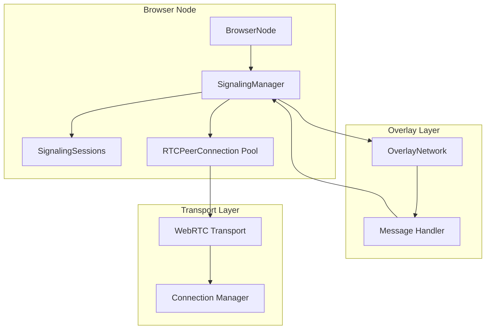
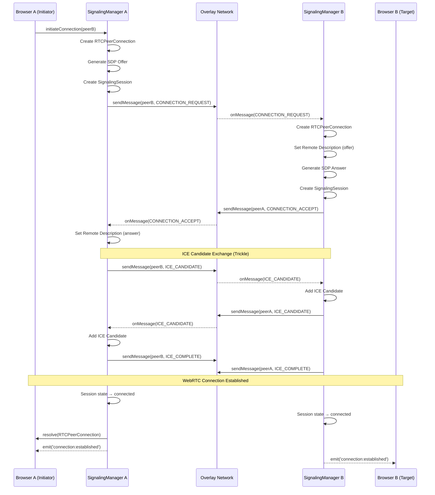
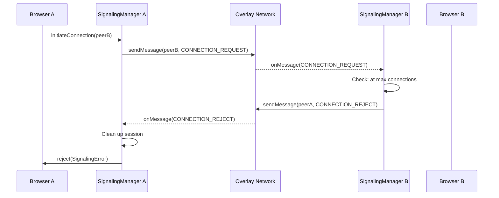
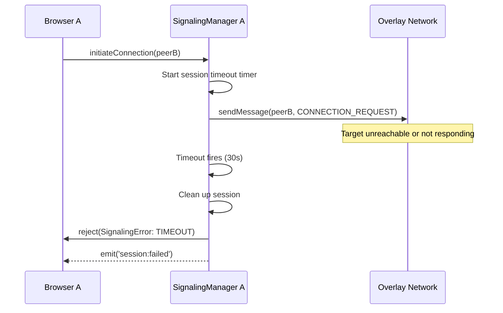

# Design Document: Overlay WebRTC Signaling

## Overview

This design enables WebRTC signaling (SDP offer/answer and ICE candidate exchange) to occur over the existing overlay messaging network. Instead of requiring dedicated signaling servers or circuit relay for connection establishment, browser nodes exchange WebRTC connection metadata through encrypted overlay messages routed via the DHT.

The key insight is that the overlay network already provides:
- End-to-end encrypted messaging between any two peers
- Reliable delivery via DHT routing with redundancy
- No need for direct connectivity (messages route through intermediaries)

By using the overlay for signaling, we eliminate the dependency on circuit relay servers for connection establishment while maintaining security through the overlay's hybrid post-quantum encryption.

## Architecture

```
┌─────────────────────────────────────────────────────────────────────────────┐
│                    OVERLAY WEBRTC SIGNALING FLOW                            │
├─────────────────────────────────────────────────────────────────────────────┤
│                                                                             │
│  ┌──────────────┐                                    ┌──────────────┐      │
│  │ Browser A    │                                    │ Browser B    │      │
│  │ (Initiator)  │                                    │ (Target)     │      │
│  └──────┬───────┘                                    └──────┬───────┘      │
│         │                                                   │              │
│         │  1. CONNECTION_REQUEST (SDP Offer)                │              │
│         │─────────────────────────────────────────────────►│              │
│         │        [via Overlay Network - encrypted]          │              │
│         │                                                   │              │
│         │  2. CONNECTION_ACCEPT (SDP Answer)                │              │
│         │◄─────────────────────────────────────────────────│              │
│         │        [via Overlay Network - encrypted]          │              │
│         │                                                   │              │
│         │  3. ICE_CANDIDATE (trickle)                       │              │
│         │◄────────────────────────────────────────────────►│              │
│         │        [bidirectional via Overlay]                │              │
│         │                                                   │              │
│         │  4. ICE_COMPLETE                                  │              │
│         │◄────────────────────────────────────────────────►│              │
│         │                                                   │              │
│         │  5. Direct WebRTC Connection Established          │              │
│         │◄═══════════════════════════════════════════════►│              │
│         │        [peer-to-peer, no relay needed]            │              │
│                                                                             │
└─────────────────────────────────────────────────────────────────────────────┘
```

### Component Diagram



## Components and Interfaces

### 1. SignalingManager (Main Facade)

```typescript
interface SignalingConfig {
  /** Session timeout in ms (default: 30000) */
  sessionTimeout?: number;
  /** Max concurrent signaling sessions (default: 10) */
  maxConcurrentSessions?: number;
  /** Retry attempts for failed messages (default: 3) */
  retryAttempts?: number;
  /** Base retry delay in ms (default: 1000) */
  retryDelayMs?: number;
  /** Enable/disable overlay signaling (default: true) */
  enabled?: boolean;
  /** ICE servers for RTCPeerConnection */
  iceServers?: RTCIceServer[];
}

interface SignalingMetrics {
  sessionsInitiated: number;
  sessionsCompleted: number;
  sessionsFailed: number;
  sessionsTimedOut: number;
  averageSessionDurationMs: number;
  activeSessions: number;
}

interface SignalingEvents {
  'session:started': (sessionId: string, remotePeerId: string) => void;
  'session:completed': (sessionId: string, remotePeerId: string) => void;
  'session:failed': (sessionId: string, remotePeerId: string, error: SignalingError) => void;
  'connection:established': (remotePeerId: string, connection: RTCPeerConnection) => void;
}

interface SignalingManager {
  // Lifecycle
  start(): void;
  stop(): void;
  
  // Connection initiation
  initiateConnection(targetPeerId: string): Promise<RTCPeerConnection>;
  
  // Session management
  getActiveSession(sessionId: string): SignalingSession | undefined;
  getActiveSessions(): SignalingSession[];
  cancelSession(sessionId: string): void;
  
  // Metrics
  getMetrics(): SignalingMetrics;
  
  // Events
  on<K extends keyof SignalingEvents>(event: K, handler: SignalingEvents[K]): void;
  off<K extends keyof SignalingEvents>(event: K, handler: SignalingEvents[K]): void;
}
```

### 2. SignalingSession

```typescript
type SignalingSessionState = 
  | 'created'           // Session created, not yet started
  | 'offer_sent'        // SDP offer sent, waiting for answer
  | 'offer_received'    // SDP offer received, generating answer
  | 'answer_sent'       // SDP answer sent, exchanging ICE
  | 'answer_received'   // SDP answer received, exchanging ICE
  | 'ice_exchange'      // Exchanging ICE candidates
  | 'connecting'        // ICE complete, attempting connection
  | 'connected'         // WebRTC connection established
  | 'failed'            // Connection failed
  | 'timed_out'         // Session timed out
  | 'cancelled';        // Session cancelled

interface SignalingSession {
  /** Unique session identifier (UUID) */
  sessionId: string;
  /** Peer ID of the remote node */
  remotePeerId: string;
  /** Whether this node initiated the session */
  isInitiator: boolean;
  /** Current session state */
  state: SignalingSessionState;
  /** RTCPeerConnection for this session */
  peerConnection: RTCPeerConnection;
  /** Timestamp when session was created */
  createdAt: number;
  /** Timestamp when session completed (if applicable) */
  completedAt?: number;
  /** Error if session failed */
  error?: SignalingError;
  /** Pending ICE candidates (received before remote description set) */
  pendingIceCandidates: RTCIceCandidate[];
}
```

### 3. Signaling Message Types

```typescript
enum SignalingMessageType {
  CONNECTION_REQUEST = 0,
  CONNECTION_ACCEPT = 1,
  CONNECTION_REJECT = 2,
  ICE_CANDIDATE = 3,
  ICE_COMPLETE = 4,
  SESSION_ERROR = 5,
}

enum ConnectionRejectReason {
  WEBRTC_UNAVAILABLE = 0,
  MAX_CONNECTIONS_REACHED = 1,
  PEER_BLOCKED = 2,
  INTERNAL_ERROR = 3,
}

enum SessionErrorCode {
  TIMEOUT = 0,
  SDP_NEGOTIATION_FAILED = 1,
  ICE_FAILED = 2,
  PEER_UNREACHABLE = 3,
  INVALID_MESSAGE = 4,
  SESSION_NOT_FOUND = 5,
}

interface ConnectionRequestMessage {
  type: SignalingMessageType.CONNECTION_REQUEST;
  sessionId: string;
  initiatorPeerId: string;
  sdpOffer: string;
}

interface ConnectionAcceptMessage {
  type: SignalingMessageType.CONNECTION_ACCEPT;
  sessionId: string;
  sdpAnswer: string;
}

interface ConnectionRejectMessage {
  type: SignalingMessageType.CONNECTION_REJECT;
  sessionId: string;
  reason: ConnectionRejectReason;
  message?: string;
}

interface IceCandidateMessage {
  type: SignalingMessageType.ICE_CANDIDATE;
  sessionId: string;
  candidate: string;        // RTCIceCandidate.candidate
  sdpMid: string | null;
  sdpMLineIndex: number | null;
}

interface IceCompleteMessage {
  type: SignalingMessageType.ICE_COMPLETE;
  sessionId: string;
}

interface SessionErrorMessage {
  type: SignalingMessageType.SESSION_ERROR;
  sessionId: string;
  errorCode: SessionErrorCode;
  errorMessage: string;
}

type SignalingMessage =
  | ConnectionRequestMessage
  | ConnectionAcceptMessage
  | ConnectionRejectMessage
  | IceCandidateMessage
  | IceCompleteMessage
  | SessionErrorMessage;
```

### 4. SignalingProtocol (Wire Format)

```typescript
interface SignalingProtocol {
  /** Protocol identifier for overlay message routing */
  readonly protocolId: string;  // '/overlay-signaling/1.0.0'
  
  /** Encode a signaling message for transmission */
  encode(message: SignalingMessage): Uint8Array;
  
  /** Decode a signaling message from bytes */
  decode(data: Uint8Array): SignalingMessage;
  
  /** Validate message structure */
  validate(message: SignalingMessage): boolean;
}
```

## Data Models

### Session Storage

```typescript
interface SessionStore {
  /** Get session by ID */
  get(sessionId: string): SignalingSession | undefined;
  
  /** Store a session */
  set(session: SignalingSession): void;
  
  /** Remove a session */
  delete(sessionId: string): void;
  
  /** Get all sessions for a peer */
  getByPeer(peerId: string): SignalingSession[];
  
  /** Get count of active sessions */
  getActiveCount(): number;
  
  /** Clean up expired sessions */
  cleanup(): void;
}
```

### Rate Limiting

```typescript
interface RateLimiter {
  /** Check if request is allowed */
  isAllowed(peerId: string): boolean;
  
  /** Record a request */
  record(peerId: string): void;
  
  /** Get remaining requests for peer */
  getRemaining(peerId: string): number;
  
  /** Reset limits for peer */
  reset(peerId: string): void;
}

interface RateLimitConfig {
  /** Max requests per window */
  maxRequests: number;
  /** Window duration in ms */
  windowMs: number;
}
```

## Sequence Diagrams

### Successful Connection Establishment



### Connection Rejection



### Session Timeout



## Correctness Properties

*A property is a characteristic or behavior that should hold true across all valid executions of a system—essentially, a formal statement about what the system should do. Properties serve as the bridge between human-readable specifications and machine-verifiable correctness guarantees.*

### Property 1: Signaling Message Serialization Round-Trip

*For any* valid SignalingMessage (CONNECTION_REQUEST, CONNECTION_ACCEPT, CONNECTION_REJECT, ICE_CANDIDATE, ICE_COMPLETE, SESSION_ERROR), encoding then decoding the message produces an equivalent message with all fields preserved.

**Validates: Requirements 1.2, 1.3, 1.5, 2.2, 4.1, 4.2, 4.3, 4.4, 4.5, 4.6**

### Property 2: Connection Request/Response Flow

*For any* connection initiation to a reachable peer:
- A CONNECTION_REQUEST message is sent via the overlay network
- The request contains a valid session ID and SDP offer
- The target responds with either CONNECTION_ACCEPT (with SDP answer) or CONNECTION_REJECT (with reason)

**Validates: Requirements 1.1, 1.4, 1.5, 5.1, 5.2**

### Property 3: ICE Candidate Exchange

*For any* active signaling session:
- ICE candidates discovered locally are sent via ICE_CANDIDATE messages
- ICE candidates received are added to the RTCPeerConnection
- Candidates are sent incrementally (trickle ICE)
- ICE_COMPLETE is sent when gathering finishes

**Validates: Requirements 2.1, 2.3, 2.4, 2.5**

### Property 4: Session Lifecycle Management

*For any* signaling session:
- The session is tracked by session ID from creation
- A timeout is set when the session is created
- If timeout fires, the session is cleaned up and initiator notified
- On successful connection, the session is removed
- On failure, the session is cleaned up and retry is allowed

**Validates: Requirements 3.1, 3.2, 3.3, 3.4, 3.5, 5.4, 5.5**

### Property 5: Concurrent Session Limits

*For any* peer attempting to create signaling sessions:
- The number of concurrent sessions never exceeds maxConcurrentSessions
- Multiple WebRTC connections to different peers are supported
- New session requests beyond the limit are rejected

**Validates: Requirements 3.6, 5.6**

### Property 6: Message Validation

*For any* incoming signaling message:
- Messages with invalid session IDs are rejected
- Messages from unexpected peers are rejected
- Invalid message structures are dropped

**Validates: Requirements 8.2, 8.3**

### Property 7: Rate Limiting

*For any* peer sending connection requests:
- Requests beyond the rate limit are rejected
- Rate limits reset after the configured window

**Validates: Requirements 8.4**

### Property 8: Retry with Exponential Backoff

*For any* signaling message that fails to deliver:
- The message is retried up to retryAttempts times
- Each retry uses exponential backoff (delay doubles)
- After max retries, the session fails with appropriate error

**Validates: Requirements 7.1**

### Property 9: Configuration Defaults

*For any* SignalingManager created without explicit configuration:
- sessionTimeout defaults to 30000ms
- maxConcurrentSessions defaults to 10
- retryAttempts defaults to 3
- retryDelayMs defaults to 1000ms
- enabled defaults to true

**Validates: Requirements 9.1, 9.2, 9.3, 9.4, 9.5**

### Property 10: Metrics Tracking

*For any* signaling activity:
- sessionsInitiated increments when a session is created as initiator
- sessionsCompleted increments when a session reaches connected state
- sessionsFailed increments when a session fails
- sessionsTimedOut increments when a session times out
- averageSessionDurationMs is updated on session completion

**Validates: Requirements 10.1, 10.2, 10.3, 10.4**

## Error Handling

### Error Types

```typescript
enum SignalingErrorCode {
  // Session errors
  SESSION_TIMEOUT = 'SESSION_TIMEOUT',
  SESSION_NOT_FOUND = 'SESSION_NOT_FOUND',
  SESSION_CANCELLED = 'SESSION_CANCELLED',
  MAX_SESSIONS_REACHED = 'MAX_SESSIONS_REACHED',
  
  // Connection errors
  PEER_UNREACHABLE = 'PEER_UNREACHABLE',
  CONNECTION_REJECTED = 'CONNECTION_REJECTED',
  SDP_NEGOTIATION_FAILED = 'SDP_NEGOTIATION_FAILED',
  ICE_FAILED = 'ICE_FAILED',
  
  // Protocol errors
  INVALID_MESSAGE = 'INVALID_MESSAGE',
  UNEXPECTED_MESSAGE = 'UNEXPECTED_MESSAGE',
  
  // Rate limiting
  RATE_LIMITED = 'RATE_LIMITED',
}

class SignalingError extends Error {
  code: SignalingErrorCode;
  sessionId?: string;
  remotePeerId?: string;
  cause?: Error;
}
```

### Error Handling Strategy

| Error | Cause | Recovery |
|-------|-------|----------|
| SESSION_TIMEOUT | No response within timeout | Clean up session, allow retry |
| PEER_UNREACHABLE | Overlay message delivery failed | Retry with backoff, then fail |
| CONNECTION_REJECTED | Target rejected connection | Report reason, allow retry later |
| SDP_NEGOTIATION_FAILED | Invalid SDP or incompatible | Clean up, report error |
| ICE_FAILED | No viable network path | Clean up, fall back to relay |
| RATE_LIMITED | Too many requests | Wait and retry |
| MAX_SESSIONS_REACHED | Concurrent session limit | Queue or reject |

## Testing Strategy

### Unit Tests

- SignalingProtocol: Encode/decode all message types
- SessionStore: CRUD operations, cleanup
- RateLimiter: Allow/deny logic, window reset
- SignalingSession: State transitions
- Configuration validation

### Property-Based Tests

Each correctness property will be implemented as a property-based test using fast-check:

1. **Property 1 (Message Round-Trip)**: Generate random signaling messages, verify encode/decode preserves all fields
2. **Property 2 (Request/Response)**: Simulate connection initiation, verify message flow
3. **Property 3 (ICE Exchange)**: Generate ICE candidates, verify trickle behavior
4. **Property 4 (Session Lifecycle)**: Simulate various session outcomes, verify cleanup
5. **Property 5 (Concurrent Limits)**: Generate many session requests, verify limits enforced
6. **Property 6 (Validation)**: Generate invalid messages, verify rejection
7. **Property 7 (Rate Limiting)**: Generate burst requests, verify limiting
8. **Property 8 (Retry Backoff)**: Simulate failures, verify retry timing
9. **Property 9 (Defaults)**: Create managers without config, verify defaults
10. **Property 10 (Metrics)**: Simulate activity, verify metric updates

### Integration Tests

- End-to-end connection establishment between two browser nodes
- Connection rejection scenarios
- Timeout handling
- ICE candidate exchange with real RTCPeerConnection
- Integration with existing overlay network
- Fallback to circuit relay when direct connection fails

## File Structure

```
src/browser/
├── signaling/
│   ├── index.ts                    # Main exports
│   ├── signaling-manager.ts        # SignalingManager class
│   ├── signaling-session.ts        # SignalingSession class
│   ├── signaling-protocol.ts       # Message encoding/decoding
│   ├── session-store.ts            # Session storage
│   ├── rate-limiter.ts             # Rate limiting
│   ├── types.ts                    # TypeScript interfaces
│   └── __tests__/
│       ├── signaling-manager.test.ts
│       ├── signaling-manager.property.test.ts
│       ├── signaling-protocol.test.ts
│       ├── signaling-protocol.property.test.ts
│       ├── session-store.test.ts
│       └── rate-limiter.test.ts
├── browser-node.ts                 # Update to use SignalingManager
└── ...
```

## Integration with BrowserNode

The SignalingManager integrates with BrowserNode as follows:

```typescript
class BrowserNode {
  private signalingManager: SignalingManager | null = null;
  
  async start(): Promise<void> {
    // ... existing startup code ...
    
    // Initialize signaling manager after overlay is ready
    if (this.config.enableOverlaySignaling && this.overlayNetwork) {
      this.signalingManager = new SignalingManager({
        overlay: this.overlayNetwork,
        iceServers: this.config.iceServers,
        ...this.config.signaling,
      });
      
      // Register signaling message handler with overlay
      this.overlayNetwork.onMessage(async (payload, context) => {
        // Check if this is a signaling message
        if (this.signalingManager?.isSignalingMessage(payload)) {
          return this.signalingManager.handleMessage(payload, context);
        }
        // Otherwise, pass to application handler
        return this.messageHandler?.(payload, context);
      });
      
      this.signalingManager.start();
    }
  }
  
  /**
   * Establish a direct WebRTC connection to a peer via overlay signaling
   */
  async connectToPeer(targetPeerId: string): Promise<void> {
    if (!this.signalingManager) {
      throw new Error('Overlay signaling is not enabled');
    }
    
    const connection = await this.signalingManager.initiateConnection(targetPeerId);
    // Connection is automatically registered with libp2p
  }
}
```

## Configuration Extension

```typescript
interface BrowserNodeConfig {
  // ... existing config ...
  
  /** Enable overlay-based WebRTC signaling (default: true) */
  enableOverlaySignaling?: boolean;
  
  /** Signaling configuration */
  signaling?: SignalingConfig;
}
```

## Fallback Behavior

When overlay signaling fails or is disabled, the browser node falls back to circuit relay:

1. If `enableOverlaySignaling` is false, use circuit relay only
2. If overlay signaling times out, attempt circuit relay
3. If direct WebRTC fails after signaling, fall back to relayed connection
4. Circuit relay remains available as a reliable fallback

This ensures connectivity even when direct WebRTC is not possible.
