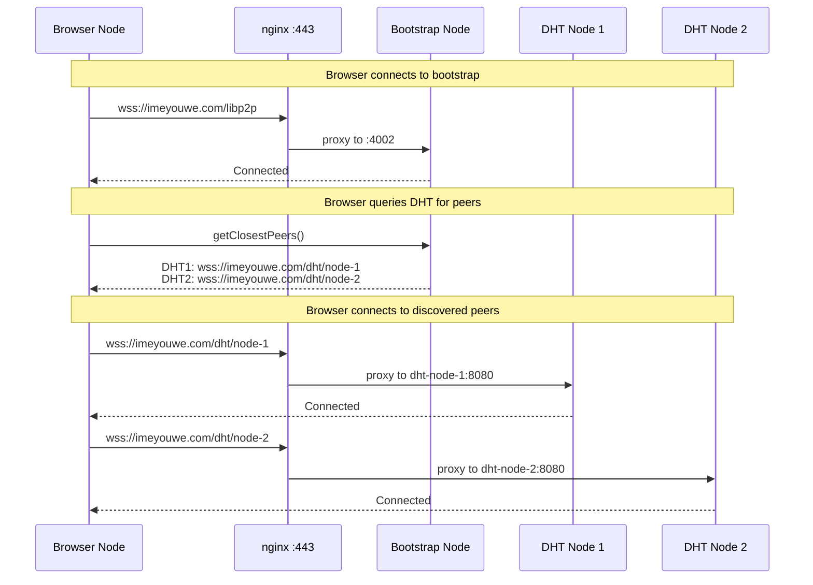

# Design Document: Public Address Advertisement

## Overview

This design addresses the critical issue where DHT nodes advertise internal Docker addresses instead of public nginx addresses, preventing browser nodes and external clients from connecting to discovered peers.

The solution ensures all server-side nodes (bootstrap and DHT nodes) properly configure their announce addresses at creation time using `withAnnounceAddresses()`, and that browser nodes correctly filter and handle the addresses they receive.

## Architecture

### Address Flow



### Node Address Configuration

```mermaid
graph TB
    subgraph "Server Node Startup"
        ENV[Environment Variables<br/>EXTERNAL_HOST, PUBLIC_PATH]
        BUILD[Build Announce Address<br/>/dns4/host/tcp/443/wss/http-path/path]
        CONFIG[DHTConfigBuilder<br/>.withAnnounceAddresses]
        CREATE[Create libp2p Node]
        START[Start Node]
        
        ENV --> BUILD
        BUILD --> CONFIG
        CONFIG --> CREATE
        CREATE --> START
    end
    
    subgraph "Browser Node Startup"
        FETCH[Fetch /browser/config]
        PARSE[Parse bootstrap addresses]
        DIAL[Dial bootstrap via WSS]
        DHT[Join DHT]
        DISCOVER[Discover peers]
        FILTER[Filter for dialable addresses]
        CONNECT[Connect to peers]
        
        FETCH --> PARSE
        PARSE --> DIAL
        DIAL --> DHT
        DHT --> DISCOVER
        DISCOVER --> FILTER
        FILTER --> CONNECT
    end
```



## Deployment Scripts Integration

This spec focuses on the **application layer** (node code) and works with the existing **deployment layer** (scripts). The deployment scripts do NOT need modification.

### Existing Scripts (No Changes Required)

1. **`scripts/DockerServerUp.sh N`** - Starts N DHT nodes with environment variables:
   - `NODE_INDEX=1..N` - Unique index for each node
   - `NODE_ID=node-1..node-N` - Human-readable node identifier
   - `PUBLIC_PATH=/dht/node-1../dht/node-N` - nginx routing path

2. **`scripts/generate-nginx-config.sh N`** - Generates `nginx/dht-nodes.conf`:
   - Creates location blocks for `/dht/node-1` through `/dht/node-N`
   - Routes each path to the corresponding Docker container

### Integration Flow

```
┌─────────────────────────────────────────────────────────────────────┐
│                     Deployment Layer (Scripts)                       │
├─────────────────────────────────────────────────────────────────────┤
│  DockerServerUp.sh 15                                               │
│    ├── Sets NODE_INDEX=1, PUBLIC_PATH=/dht/node-1 for node 1       │
│    ├── Sets NODE_INDEX=2, PUBLIC_PATH=/dht/node-2 for node 2       │
│    └── ...                                                          │
│                                                                     │
│  generate-nginx-config.sh 15                                        │
│    └── Creates nginx routes: /dht/node-N → dht-node-N:8080         │
└─────────────────────────────────────────────────────────────────────┘
                                    │
                                    ▼
┌─────────────────────────────────────────────────────────────────────┐
│                    Application Layer (This Spec)                     │
├─────────────────────────────────────────────────────────────────────┤
│  node.ts reads environment variables:                               │
│    EXTERNAL_HOST=imeyouwe.com                                       │
│    PUBLIC_PATH=/dht/node-1                                          │
│                                                                     │
│  Builds announce address:                                           │
│    /dns4/imeyouwe.com/tcp/443/wss/http-path/dht%2Fnode-1           │
│                                                                     │
│  Configures with withAnnounceAddresses() at creation time          │
└─────────────────────────────────────────────────────────────────────┘
```

The spec fixes how `node.ts` and `ws-bridge.ts` **use** the environment variables to configure announce addresses, not how the variables are set.

## Components

### 0. Custom WebSocket Transport with http-path Support (factory.ts)

**Critical Discovery**: The standard `@libp2p/websockets` transport does not recognize the `http-path` multiaddr component. When server nodes try to dial peers using public addresses like `/dns4/imeyouwe.com/tcp/443/wss/http-path/dht%2Fnode-1`, the transport rejects them as invalid, causing `NoValidAddressesError`.

**Solution**: Both server nodes (via `factory.ts`) and browser nodes (via `websocket-transport.ts`) must use a custom WebSocket transport that accepts multiaddrs with `http-path`:

```typescript
// In src/dht/factory.ts
function isWebSocketMultiaddr(ma: Multiaddr): boolean {
  const str = ma.toString();
  return str.includes('/ws/') || str.includes('/wss/') || 
         str.endsWith('/ws') || str.endsWith('/wss');
}

function webSocketsWithHttpPath(): ReturnType<typeof webSockets> {
  const baseTransport = webSockets();
  
  return (components) => {
    const transport = baseTransport(components) as Transport;
    
    // Override dialFilter to accept http-path multiaddrs
    const originalDialFilter = transport.dialFilter?.bind(transport);
    transport.dialFilter = (multiaddrs: Multiaddr[]): Multiaddr[] => {
      const standardMatches = originalDialFilter ? originalDialFilter(multiaddrs) : [];
      
      // Add WebSocket multiaddrs that weren't matched (e.g., with http-path)
      const additionalMatches = multiaddrs.filter(ma => {
        if (standardMatches.some(m => m.toString() === ma.toString())) {
          return false;
        }
        return isWebSocketMultiaddr(ma);
      });
      
      return [...standardMatches, ...additionalMatches];
    };
    
    return transport;
  };
}

// Use in buildLibp2pOptions:
const transports: any[] = [
  tcp(),
  webSocketsWithHttpPath(),  // NOT webSockets()
];
```

Without this fix, server nodes cannot dial each other via public addresses, resulting in:
- `NoValidAddressesError: The dial request has no valid addresses`
- DHT routing table stays empty or has only 1 peer
- DHT store/retrieve operations fail

### 1. Server Node Configuration (node.ts)

The key change is configuring announce addresses at node creation time, not after start.

```typescript
// BEFORE (broken): Using addObservedAddr after start
const node = new DHTNode(config);
await node.start();
// This doesn't properly propagate to DHT responses
addressManager.addObservedAddr(multiaddr(announceAddr));

// AFTER (correct): Configure at creation time
const announceAddr = `/dns4/${EXTERNAL_HOST}/tcp/443/wss/http-path/${pathComponent}`;

const configBuilder = DHTConfigBuilder.create()
  .withListenAddresses([...])
  .withAnnounceAddresses([announceAddr])  // Set BEFORE node creation
  .withBootstrapPeers([...]);

const node = new DHTNode(configBuilder.build());
await node.start();
```

### 2. Bootstrap Node Configuration (ws-bridge.ts)

The bootstrap node must also advertise its public address:

```typescript
const PUBLIC_PATH = 'libp2p';  // nginx routes /libp2p to bootstrap's libp2p port
const announceAddr = `/dns4/${EXTERNAL_HOST}/tcp/443/wss/http-path/${PUBLIC_PATH}`;

const configBuilder = DHTConfigBuilder.create()
  .withListenAddresses([
    `/ip4/0.0.0.0/tcp/4001`,
    `/ip4/0.0.0.0/tcp/4002/ws`,
  ])
  .withAnnounceAddresses([announceAddr])
  .withCircuitRelay(true);
```

### 3. Address Format

The multiaddr format for nginx path-based routing:

```
/dns4/{hostname}/tcp/443/wss/http-path/{url-encoded-path}
```

Examples:
- Bootstrap: `/dns4/imeyouwe.com/tcp/443/wss/http-path/libp2p`
- DHT Node 1: `/dns4/imeyouwe.com/tcp/443/wss/http-path/dht%2Fnode-1`
- DHT Node 5: `/dns4/imeyouwe.com/tcp/443/wss/http-path/dht%2Fnode-5`

Note: The path must be URL-encoded (`/` becomes `%2F`).

### 4. Browser Node Address Filtering

Browser nodes must filter received addresses for ones they can dial:

```typescript
function canDialAddress(addr: string): boolean {
  // Browser can dial:
  // 1. WSS addresses (wss://)
  // 2. WebRTC addresses (/webrtc/)
  // 3. Circuit relay addresses (/p2p-circuit/)
  
  return addr.includes('/wss/') || 
         addr.includes('/wss') ||
         addr.includes('/webrtc/') ||
         addr.includes('/p2p-circuit/');
}

// When receiving peers from DHT
const dialableAddrs = peerAddrs.filter(canDialAddress);
```

### 5. /info Endpoint Enhancement

Add announce address visibility to the /info endpoint:

```typescript
res.end(JSON.stringify({
  nodeId: NODE_ID,
  peerId: node?.peerId.toString(),
  // Existing fields...
  
  // New fields for debugging
  announceAddresses: config.announceAddresses,
  isAdvertisingPublicAddress: config.announceAddresses?.some(
    addr => addr.includes('/dns4/') && addr.includes('/wss/')
  ),
  listenAddresses: node?.multiaddrs.map(a => a.toString()),
}, null, 2));
```

## Data Models

### NodeAddressConfig

```typescript
interface NodeAddressConfig {
  /** Internal listen addresses (for Docker network) */
  listenAddresses: string[];
  
  /** Public announce addresses (for DHT advertisement) */
  announceAddresses: string[];
  
  /** External hostname (e.g., "imeyouwe.com") */
  externalHost: string;
  
  /** Public path for nginx routing (e.g., "/dht/node-1") */
  publicPath: string;
}
```

### AddressValidationResult

```typescript
interface AddressValidationResult {
  isValid: boolean;
  hasPublicAddress: boolean;
  hasInternalAddress: boolean;
  warnings: string[];
}

function validateNodeAddresses(config: NodeAddressConfig): AddressValidationResult {
  const warnings: string[] = [];
  let hasPublicAddress = false;
  let hasInternalAddress = false;
  
  for (const addr of config.announceAddresses) {
    if (addr.includes('/dns4/') && addr.includes('/wss/')) {
      hasPublicAddress = true;
    }
    if (addr.match(/\/ip4\/(172\.|10\.|192\.168\.)/)) {
      hasInternalAddress = true;
      warnings.push(`Internal address detected: ${addr}`);
    }
  }
  
  if (!hasPublicAddress) {
    warnings.push('No public WSS address configured');
  }
  
  return {
    isValid: hasPublicAddress && !hasInternalAddress,
    hasPublicAddress,
    hasInternalAddress,
    warnings,
  };
}
```


## Correctness Properties

*A property is a characteristic or behavior that should hold true across all valid executions of a system—essentially, a formal statement about what the system should do. Properties serve as the bridge between human-readable specifications and machine-verifiable correctness guarantees.*

### Property 1: Server Node Address Format Validity

*For any* valid EXTERNAL_HOST and PUBLIC_PATH combination, the generated announce address SHALL:
- Start with `/dns4/{EXTERNAL_HOST}/tcp/443/wss/http-path/`
- Contain the URL-encoded PUBLIC_PATH
- NOT end with `/p2p/{peerId}` (libp2p appends this automatically)

**Validates: Requirements 1.2, 1.3, 3.1, 3.2**

### Property 2: No Private Addresses in Announce Configuration

*For any* generated announce address configuration, the addresses SHALL NOT contain:
- Private IPv4 ranges (172.16-31.x.x, 10.x.x.x, 192.168.x.x)
- Localhost addresses (127.0.0.1, localhost)
- Docker internal DNS names (e.g., libp2p-bootstrap, dht-node-1)

**Validates: Requirements 1.4, 1.5**

### Property 3: Address Dialability Filter

*For any* list of multiaddrs, the browser dialability filter SHALL return only addresses that:
- Contain `/wss/` or end with `/wss` (WebSocket Secure)
- OR contain `/webrtc/` (WebRTC transport)
- OR contain `/p2p-circuit/` (Circuit relay)

And SHALL exclude addresses that:
- Contain only TCP without WebSocket (`/tcp/` without `/ws`)
- Contain private IP ranges

**Validates: Requirements 1b.5, 3.4, 4.3**

### Property 4: Address Validation Correctness

*For any* NodeAddressConfig, the validation function SHALL:
- Return `hasPublicAddress: true` if and only if at least one address contains `/dns4/` AND `/wss/`
- Return `hasInternalAddress: true` if and only if at least one address matches private IP patterns
- Return `isValid: true` if and only if `hasPublicAddress && !hasInternalAddress`

**Validates: Requirements 5.3, 6.2, 6.4**

### Property 5: DHT Node Index to Path Mapping

*For any* NODE_INDEX in range [1, 60], the generated public path SHALL be `/dht/node-{NODE_INDEX}` and the URL-encoded form SHALL be `dht%2Fnode-{NODE_INDEX}`.

**Validates: Requirements 3.1, 3.2**

## Error Handling

### Invalid Environment Configuration

If EXTERNAL_HOST is not set or is "localhost" in production:
- Log a warning: "Node is not configured with a public external host"
- Continue startup but mark health check as degraded
- Include warning in /info endpoint response

### Address Parsing Errors

If an announce address cannot be parsed as a valid multiaddr:
- Log error with the invalid address
- Skip the invalid address but continue with valid ones
- If no valid announce addresses remain, fail startup with clear error

### DHT Query Failures

If a peer returns addresses that fail validation:
- Log warning with peer ID and invalid addresses
- Filter out invalid addresses but keep valid ones
- If peer has no valid addresses, exclude from results but don't fail query

## Testing Strategy

### Unit Tests

1. **Address Generation Tests**
   - Test `buildAnnounceAddress(host, path)` produces correct format
   - Test URL encoding of paths with special characters
   - Test with various valid host/path combinations

2. **Address Validation Tests**
   - Test `validateNodeAddresses()` correctly identifies public vs internal
   - Test detection of all private IP ranges
   - Test localhost detection

3. **Address Filter Tests**
   - Test `canDialAddress()` for browser nodes
   - Test filtering of mixed address lists
   - Test edge cases (empty lists, all invalid, all valid)

### Property-Based Tests

Using fast-check for property-based testing:

1. **Property 1: Address Format**
   - Generate random valid hostnames and paths
   - Verify output matches expected format
   - Minimum 100 iterations

2. **Property 2: No Private Addresses**
   - Generate addresses and verify none contain private ranges
   - Test with edge cases near private range boundaries

3. **Property 3: Dialability Filter**
   - Generate mixed lists of addresses
   - Verify filter output contains only dialable addresses
   - Verify no false negatives (dialable addresses incorrectly filtered)

4. **Property 4: Validation Correctness**
   - Generate various NodeAddressConfig combinations
   - Verify validation results match expected logic

### Integration Tests

1. **Node Startup Verification**
   - Start a node with test configuration
   - Query /info endpoint
   - Verify announce addresses are public format

2. **DHT Peer Discovery**
   - Start multiple nodes
   - Perform DHT query from one node
   - Verify returned addresses are all public

3. **Browser Node Connection**
   - Start server nodes
   - Connect browser node
   - Verify browser can connect to multiple peers via discovered addresses
