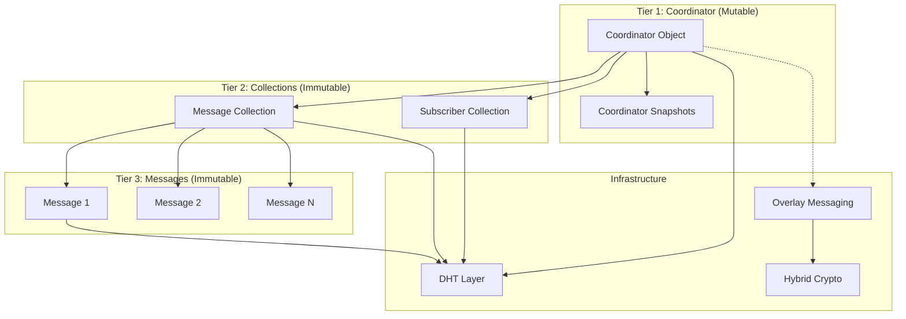
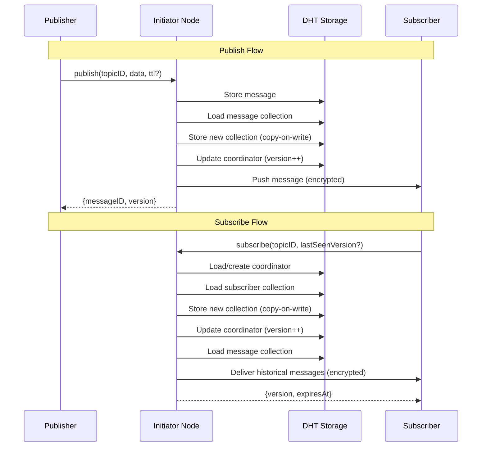
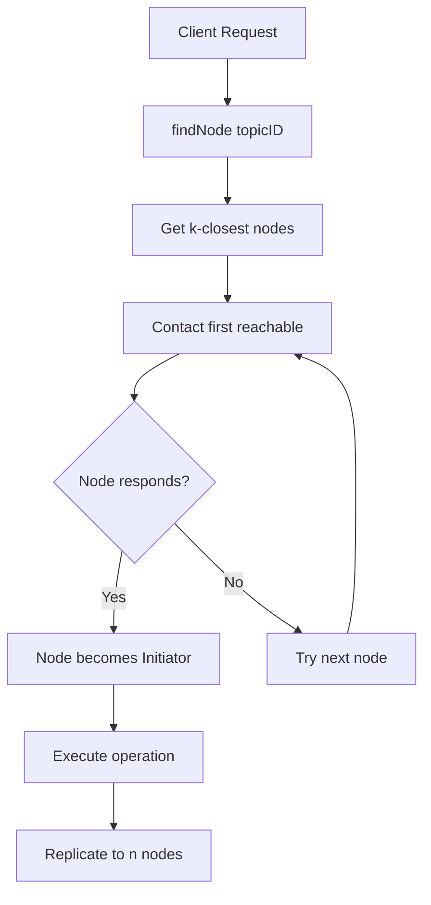
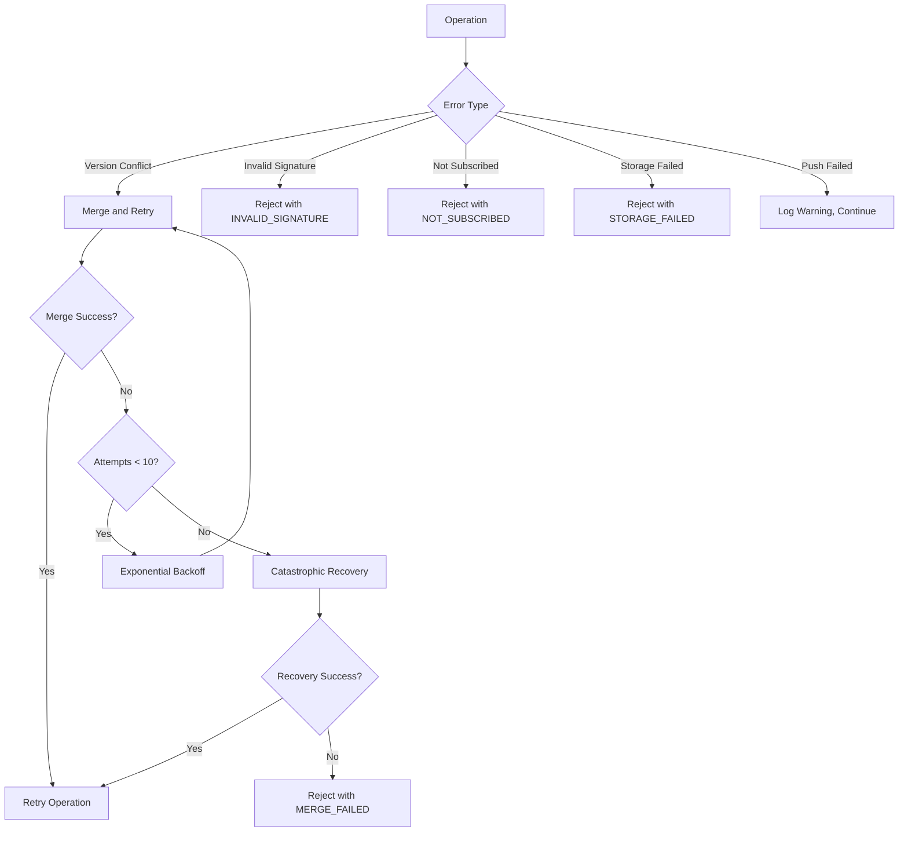

# Design Document: Sticky Pub/Sub

## Overview

Sticky Pub/Sub is a DHT-based publish-subscribe system with message persistence. Unlike traditional pub/sub where subscribers only receive messages published after they join, Sticky Pub/Sub delivers historical messages to new subscribers (hence "sticky"). The system is fully decentralized, using the DHT for storage and the overlay messaging layer for encrypted message delivery.

**Prerequisites:** This feature requires the overlay-messaging layer to be implemented first.

### Architecture Overview

The system uses a three-tier architecture:



### Message Flow



## Architecture

### Component Responsibilities

1. **StickyPubSub**: Main facade providing `subscribe()`, `publish()`, `unsubscribe()`, `renew()` APIs
2. **CoordinatorManager**: Handles coordinator CRUD, replication, and conflict resolution
3. **CollectionManager**: Manages immutable subscriber and message collections
4. **MessageDelivery**: Handles push delivery to subscribers with deterministic assignment
5. **ClientRecovery**: Tracks versions, detects gaps, handles deduplication
6. **GarbageCollector**: Lazy cleanup of expired entries during operations

### Integration with Existing Layers

**DHT Layer:**
- Uses `put()`/`get()` for coordinator and collection storage
- Uses `findNode()` to locate k-closest nodes for topic
- Leverages DHT TTL for automatic collection expiry

**Overlay Messaging Layer:**
- Uses `sendMessage()` for encrypted push delivery
- Uses `onMessage()` to receive push notifications
- Leverages hybrid post-quantum encryption (X25519 + ML-KEM-768)

### Initiator Node Concept

When a client wants to publish or subscribe:
1. Client performs `findNode(topicID)` to get k-closest nodes
2. Client contacts the first reachable node (becomes initiator)
3. Initiator coordinates the operation and replicates to other k-closest nodes



## Components and Interfaces

### 1. StickyPubSub (Main Facade)

```typescript
interface StickyPubSubConfig {
  defaultSubscriptionTTL?: number;    // Default: 1800000 (30 minutes)
  defaultMessageTTL?: number;         // Default: 86400000 (24 hours)
  maxHistorySize?: number;            // Default: 50
  replicationFactor?: number;         // Default: 3
  snapshotThreshold?: number;         // Default: 100
  collectionGracePeriod?: number;     // Default: 3600000 (1 hour)
}

interface SubscribeOptions {
  lastSeenVersion?: number;           // For delta delivery
  subscriptionTTL?: number;           // Override default TTL
}

interface PublishOptions {
  ttl?: number;                       // Override default message TTL
  metadata?: Record<string, unknown>; // Optional message metadata
}

interface SubscribeResult {
  success: boolean;
  version: number;
  expiresAt: number;
  historicalMessages: Message[];
}

interface PublishResult {
  success: boolean;
  messageId: string;
  version: number;
  deliveredTo: number;
}

interface RenewResult {
  success: boolean;
  newExpiresAt: number;
}

interface StickyPubSub {
  // Lifecycle
  start(): Promise<void>;
  stop(): Promise<void>;
  
  // Core operations
  subscribe(
    topicId: string,
    options?: SubscribeOptions
  ): Promise<SubscribeResult>;
  
  publish(
    topicId: string,
    data: Uint8Array,
    options?: PublishOptions
  ): Promise<PublishResult>;
  
  unsubscribe(topicId: string): Promise<void>;
  
  renew(topicId: string, newTTL?: number): Promise<RenewResult>;
  
  // Message handling
  onMessage(handler: (message: Message, topicId: string) => void): void;
  offMessage(): void;
  
  // Recovery
  requestFullUpdate(topicId: string, fromVersion: number): Promise<Message[]>;
  
  // Access to underlying layers
  readonly dht: DHTNode;
  readonly overlay: OverlayNetwork;
  readonly peerId: string;
}
```

### 2. CoordinatorManager

```typescript
interface CoordinatorManager {
  // Load or create coordinator for topic
  getOrCreate(topicId: string): Promise<Coordinator>;
  
  // Update coordinator with optimistic concurrency
  update(
    topicId: string,
    updater: (coord: Coordinator) => Coordinator
  ): Promise<Coordinator>;
  
  // Replicate to n closest nodes
  replicate(topicId: string, coordinator: Coordinator): Promise<void>;
  
  // Merge conflicting coordinators
  merge(ours: Coordinator, theirs: Coordinator): Promise<Coordinator>;
  
  // Create snapshot when coordinator grows too large
  createSnapshot(coordinator: Coordinator): Promise<string>;
  
  // Delete coordinator (when all content expired)
  delete(topicId: string): Promise<void>;
}
```

### 3. CollectionManager

```typescript
interface CollectionManager {
  // Subscriber collections
  loadSubscriberCollection(collectionId: string): Promise<SubscriberCollection>;
  createSubscriberCollection(
    topicId: string,
    subscribers: Subscriber[],
    version: number
  ): Promise<SubscriberCollection>;
  
  // Message collections
  loadMessageCollection(collectionId: string): Promise<MessageCollection>;
  createMessageCollection(
    topicId: string,
    messages: MessageRef[],
    version: number
  ): Promise<MessageCollection>;
  
  // Store collection with content-based TTL
  storeCollection(collection: Collection): Promise<string>;
  
  // Merge collections (union)
  mergeSubscriberCollections(
    a: SubscriberCollection,
    b: SubscriberCollection
  ): SubscriberCollection;
  
  mergeMessageCollections(
    a: MessageCollection,
    b: MessageCollection
  ): MessageCollection;
}
```

### 4. MessageDelivery

```typescript
interface MessageDelivery {
  // Deliver message to all active subscribers
  deliverToSubscribers(
    topicId: string,
    message: Message,
    subscribers: Subscriber[]
  ): Promise<number>;
  
  // Deliver historical messages to new subscriber
  deliverHistorical(
    topicId: string,
    subscriberId: string,
    messages: Message[]
  ): Promise<void>;
  
  // Deterministic subscriber assignment
  getAssignedSubscribers(
    subscriberId: string,
    topicId: string,
    allSubscribers: Subscriber[],
    coordinatorNodes: string[]
  ): Subscriber[];
}
```

### 5. ClientRecovery

```typescript
interface ClientRecovery {
  // Track last seen version per topic
  getLastSeenVersion(topicId: string): number | undefined;
  setLastSeenVersion(topicId: string, version: number): void;
  
  // Detect version gaps
  detectGap(topicId: string, receivedVersion: number): boolean;
  
  // Deduplicate messages
  isDuplicate(messageId: string): boolean;
  recordMessage(messageId: string): void;
  
  // Track per-publisher sequences for drop detection
  recordPublisherSequence(publisherId: string, sequence: number): void;
  detectDroppedMessages(publisherId: string, sequence: number): number[];
}
```

## Data Models

### Coordinator Object

```typescript
interface Coordinator {
  topicId: string;
  version: number;                      // Monotonic counter
  currentSubscribers: string | null;    // Collection ID
  currentMessages: string | null;       // Collection ID
  
  // Separate histories for each collection type
  subscriberHistory: string[];          // Last N subscriber collection IDs
  messageHistory: string[];             // Last N message collection IDs
  
  // Link to historical snapshot
  previousCoordinator: string | null;   // Snapshot ID for deep history
  
  createdAt: number;
  lastModified: number;
  state: 'ACTIVE' | 'RECOVERING' | 'FAILED';
}

interface CoordinatorSnapshot {
  version: number;
  subscriberHistory: string[];
  messageHistory: string[];
  previousCoordinator: string | null;
  isSnapshot: true;
  createdAt: number;
  expiresAt: number;                    // TTL: 1 hour
}
```

### Subscriber Collection

```typescript
interface Subscriber {
  clientId: string;                     // Node peer ID
  subscribedAt: number;
  expiresAt: number;                    // Subscription expiry
  lastSeenVersion: number | null;       // For delta delivery
  metadata?: Record<string, unknown>;
}

interface SubscriberCollection {
  collectionId: string;                 // Content-addressed hash
  topicId: string;
  subscribers: Subscriber[];
  version: number;                      // Coordinator version when created
  createdAt: number;
  expiresAt: number;                    // max(subscriber expiries) + grace
}
```

### Message Collection

```typescript
interface MessageRef {
  messageId: string;                    // DHT location of message
  addedInVersion: number;               // For delta delivery
  publishedAt: number;
  expiresAt: number;
  size: number;                         // For lazy loading
  publisherId: string;
  publisherSequence: number;            // For drop detection
  metadata?: Record<string, unknown>;
}

interface MessageCollection {
  collectionId: string;                 // Content-addressed hash
  topicId: string;
  messages: MessageRef[];
  version: number;                      // Coordinator version when created
  createdAt: number;
  expiresAt: number;                    // max(message expiries) + grace
}
```

### Individual Message

```typescript
interface Message {
  messageId: string;
  topicId: string;
  publisherId: string;
  publisherSequence: number;
  addedInVersion: number;
  data: Uint8Array;                     // Payload (encrypted by overlay)
  publishedAt: number;
  expiresAt: number;
  signature?: Uint8Array;               // Optional cryptographic signature
}
```

### Error Types

```typescript
enum PubSubErrorCode {
  // Topic errors
  TOPIC_NOT_FOUND = 'TOPIC_NOT_FOUND',
  
  // Subscription errors
  NOT_SUBSCRIBED = 'NOT_SUBSCRIBED',
  INVALID_SIGNATURE = 'INVALID_SIGNATURE',
  RENEWAL_EXPIRED = 'RENEWAL_EXPIRED',
  
  // Publish errors
  STORAGE_FAILED = 'STORAGE_FAILED',
  
  // Conflict errors
  MERGE_FAILED = 'MERGE_FAILED',
  VERSION_CONFLICT = 'VERSION_CONFLICT',
  
  // Recovery errors
  RECOVERY_FAILED = 'RECOVERY_FAILED',
}

class PubSubError extends Error {
  code: PubSubErrorCode;
  topicId?: string;
  cause?: Error;
}
```

### Configuration Defaults

```typescript
const DEFAULT_PUBSUB_CONFIG: Required<StickyPubSubConfig> = {
  defaultSubscriptionTTL: 1800000,      // 30 minutes
  defaultMessageTTL: 86400000,          // 24 hours
  maxHistorySize: 50,
  replicationFactor: 3,
  snapshotThreshold: 100,
  collectionGracePeriod: 3600000,       // 1 hour
};
```


## Correctness Properties

*A property is a characteristic or behavior that should hold true across all valid executions of a system—essentially, a formal statement about what the system should do. Properties serve as the bridge between human-readable specifications and machine-verifiable correctness guarantees.*

### Property 1: Subscribe Adds Subscriber

*For any* topic ID and node ID, when subscribe is called, the resulting subscriber collection contains an entry for that node with a valid expiry time.

**Validates: Requirements 1.1**

### Property 2: Historical Message Delivery

*For any* topic with non-expired messages and a new subscriber, all non-expired messages are delivered to the subscriber upon subscription.

**Validates: Requirements 1.2**

### Property 3: Delta Delivery

*For any* subscriber providing a lastSeenVersion, only messages with addedInVersion > lastSeenVersion are delivered.

**Validates: Requirements 1.3**

### Property 4: Topic Creation on First Subscribe

*For any* non-existent topic ID, subscribing creates a new coordinator with version 1 and empty collections.

**Validates: Requirements 1.4**

### Property 5: Lazy Cleanup of Expired Entries

*For any* collection containing expired entries (subscribers or messages), the next subscribe or publish operation produces a new collection excluding those expired entries.

**Validates: Requirements 1.6, 2.7, 9.1, 9.2**

### Property 6: Publish Stores Message

*For any* publish operation, the message is stored in the DHT and retrievable by its message ID.

**Validates: Requirements 2.1**

### Property 7: Publish Updates Collection

*For any* publish operation, the message reference is added to the topic's message collection with correct metadata.

**Validates: Requirements 2.2**

### Property 8: Version Increment on Publish

*For any* publish operation, the coordinator version after publish equals the version before publish plus one.

**Validates: Requirements 2.3**

### Property 9: Unique Message IDs and Monotonic Sequences

*For any* sequence of publish operations from the same publisher, all message IDs are unique and publisher sequence numbers are strictly monotonically increasing.

**Validates: Requirements 2.4**

### Property 10: Custom TTL Respected

*For any* publish operation with a TTL option, the stored message's expiresAt equals publishedAt plus the specified TTL.

**Validates: Requirements 2.5**

### Property 11: Message Stored Before Coordinator Update

*For any* publish operation, even if the coordinator update fails due to conflict, the message is already stored in the DHT.

**Validates: Requirements 2.8**

### Property 12: Push Delivery to Active Subscribers

*For any* publish operation on a topic with active subscribers, all active (non-expired) subscribers receive the message via push delivery.

**Validates: Requirements 3.1**

### Property 13: Deterministic Subscriber Assignment

*For any* subscriber ID, topic ID, and set of coordinator nodes, the assigned coordinator for that subscriber is always the same (deterministic hash-based assignment).

**Validates: Requirements 3.2**

### Property 14: Messages Include Version Metadata

*For any* message delivered via push, the message includes the addedInVersion field matching the coordinator version when it was added.

**Validates: Requirements 3.5**

### Property 15: Coordinator at K-Closest Nodes

*For any* topic ID, the coordinator is stored at nodes that are among the k-closest to hash(topicID).

**Validates: Requirements 4.1**

### Property 16: Coordinator Replication

*For any* coordinator update, the updated coordinator is replicated to n closest nodes (where n is the replication factor).

**Validates: Requirements 4.2**

### Property 17: Coordinator Structure

*For any* coordinator object, it contains all required fields: version, currentSubscribers, currentMessages, subscriberHistory, messageHistory, previousCoordinator, createdAt, lastModified, state.

**Validates: Requirements 4.3**

### Property 18: Separate Collection Histories

*For any* coordinator, subscriberHistory contains only subscriber collection IDs and messageHistory contains only message collection IDs, with no overlap.

**Validates: Requirements 4.4**

### Property 19: Snapshot Creation on Threshold

*For any* coordinator where subscriberHistory.length + messageHistory.length exceeds snapshotThreshold, a snapshot is created and histories are pruned.

**Validates: Requirements 4.5**

### Property 20: Collection Immutability

*For any* collection (subscriber or message), once stored, its content never changes. Updates create new collections with new IDs.

**Validates: Requirements 5.1, 5.2**

### Property 21: New Collection ID on Update

*For any* collection update operation, the resulting collection has a different collectionId than the original.

**Validates: Requirements 5.3**

### Property 22: Content-Addressed Collection IDs

*For any* two collections with identical content, their collectionIds are equal. For any two collections with different content, their collectionIds are different.

**Validates: Requirements 5.4**

### Property 23: Random Collection Storage

*For any* collection, its storage location in the DHT is not derivable from the topic ID alone.

**Validates: Requirements 5.5**

### Property 24: Collection TTL Based on Content

*For any* collection, its expiresAt equals max(item expiry times) + grace period.

**Validates: Requirements 5.6, 9.6, 9.7, 9.9**

### Property 25: Conflict Resolution via Merge

*For any* version conflict during coordinator update, the system merges the conflicting states rather than failing.

**Validates: Requirements 6.1**

### Property 26: Merge by Union

*For any* merge of two collections (subscriber or message), the result contains all entries from both collections (union semantics).

**Validates: Requirements 6.2, 6.3**

### Property 27: Common Ancestor via History

*For any* merge operation, the system uses collection ID histories to find the common ancestor for three-way merge.

**Validates: Requirements 6.4**

### Property 28: Optimistic Concurrency with Retry

*For any* coordinator update that encounters a version conflict, the system retries with merged state until success.

**Validates: Requirements 6.6**

### Property 29: Renewal Extends Expiry

*For any* valid renewal request, the subscriber's expiresAt is extended to now + newTTL.

**Validates: Requirements 7.1**

### Property 30: Signature Verification

*For any* renewal or unsubscribe request, the operation fails with INVALID_SIGNATURE if the signature doesn't match the subscriber's node ID.

**Validates: Requirements 7.2, 7.3, 12.2**

### Property 31: Replay Protection

*For any* renewal request with a timestamp older than 5 minutes, the request is rejected.

**Validates: Requirements 7.4**

### Property 32: Renewal Returns New Expiry

*For any* successful renewal, the result includes the new expiry time.

**Validates: Requirements 7.5**

### Property 33: Client Tracks Version

*For any* message received by a client, the client updates its lastSeenVersion to the message's addedInVersion if greater than current.

**Validates: Requirements 8.1**

### Property 34: Gap Detection

*For any* message received where addedInVersion > lastSeenVersion + 1, the client detects a gap and requests a full update.

**Validates: Requirements 8.2**

### Property 35: Full Update Returns Missed Messages

*For any* requestFullUpdate(fromVersion) call, all messages with addedInVersion > fromVersion are returned.

**Validates: Requirements 8.3**

### Property 36: Message Deduplication

*For any* message ID received multiple times (via push + polling), the client processes it only once.

**Validates: Requirements 8.4**

### Property 37: Drop Detection via Sequences

*For any* publisher, if a message with sequence N is received after sequence M where N > M + 1, the client detects dropped messages.

**Validates: Requirements 8.5**

### Property 38: Coordinator Deletion on Full Expiry

*For any* topic where all subscribers and messages have expired, the coordinator is deleted during the next operation.

**Validates: Requirements 9.3**

### Property 39: DHT Auto-Removes Expired Collections

*For any* collection whose TTL has expired, the DHT returns not-found when queried.

**Validates: Requirements 9.8**

### Property 40: Default Configuration Applied

*For any* StickyPubSub created without explicit configuration, the effective configuration uses all default values.

**Validates: Requirements 10.6**

### Property 41: Unsubscribe Removes Subscriber

*For any* valid unsubscribe request, the subscriber is removed from the collection.

**Validates: Requirements 12.1**

### Property 42: Unsubscribe Stops Delivery

*For any* unsubscribed node, subsequent messages are not delivered to that node.

**Validates: Requirements 12.3**

### Property 43: Subscriptions Expire Naturally

*For any* subscription that is not renewed, it is removed from the collection after its TTL expires (no explicit unsubscribe required).

**Validates: Requirements 12.4**

## Error Handling

### Error Handling Strategy

1. **Subscription Errors**: Validate signature and timestamp; reject with typed errors
2. **Publish Errors**: Store message first (survives conflicts); retry on version conflict
3. **Conflict Errors**: Merge conflicting states; trigger recovery after 10 failures
4. **Storage Errors**: Propagate DHT errors with context
5. **Delivery Errors**: Log and continue; no retry for push failures
6. **Recovery Errors**: Attempt catastrophic recovery; fail with MERGE_FAILED if unrecoverable

### Error Flow



### Catastrophic Recovery

When merge fails repeatedly (10+ attempts), the system attempts catastrophic recovery:

1. Load all known collection IDs from coordinator histories
2. Fetch all collections and merge by union
3. Create new coordinator with merged state
4. If recovery fails, mark coordinator state as FAILED

## Testing Strategy

### Testing Framework

- **Test Runner**: Vitest (consistent with existing DHT tests)
- **Property-Based Testing**: fast-check
- **Mocking**: Vitest built-in mocks for network isolation

### Test Categories

#### 1. Unit Tests

Unit tests verify individual components in isolation:

- Coordinator CRUD operations
- Collection creation and merging
- TTL calculation
- Signature verification
- Deterministic assignment algorithm
- Version tracking and gap detection
- Message deduplication

#### 2. Property-Based Tests

Property tests verify universal properties across many generated inputs:

- Subscribe/publish operations (Properties 1-14)
- Coordinator management (Properties 15-19)
- Collection immutability and addressing (Properties 20-24)
- Conflict resolution (Properties 25-28)
- Renewal and signature verification (Properties 29-32)
- Client recovery (Properties 33-37)
- Garbage collection (Properties 38-39, 43)
- Configuration (Property 40)
- Unsubscribe (Properties 41-42)

Each property test runs minimum 100 iterations with randomly generated inputs.

#### 3. Integration Tests

Integration tests verify multi-component interactions:

- End-to-end subscribe/publish flow
- Historical message delivery to new subscribers
- Delta delivery with lastSeenVersion
- Concurrent publish conflict resolution
- Push delivery to multiple subscribers
- Subscription renewal flow
- Coordinator replication across nodes

### Test Configuration

```typescript
// Property test configuration
const PROPERTY_TEST_CONFIG = {
  numRuns: 100,
  seed: undefined,
  verbose: false,
};

// Integration test network
const TEST_NETWORK_CONFIG = {
  numNodes: 5,
  subscriptionTTL: 5000,
  messageTTL: 10000,
};
```

### Test File Structure

```
src/
├── pubsub/
│   ├── sticky-pubsub.ts
│   ├── sticky-pubsub.test.ts           # Unit tests
│   ├── sticky-pubsub.property.test.ts  # Property tests
│   ├── coordinator.ts
│   ├── coordinator.test.ts
│   ├── coordinator.property.test.ts
│   ├── collection.ts
│   ├── collection.test.ts
│   ├── collection.property.test.ts
│   ├── delivery.ts
│   ├── delivery.test.ts
│   ├── recovery.ts
│   ├── recovery.test.ts
│   ├── recovery.property.test.ts
│   └── errors.ts
├── integration/
│   └── pubsub.integration.test.ts
└── test-utils/
    └── pubsub-generators.ts            # fast-check generators
```

### Generator Examples

```typescript
import * as fc from 'fast-check';

// Generate valid topic IDs
const topicIdArb = fc.string({ minLength: 1, maxLength: 64 })
  .filter(s => /^[a-zA-Z0-9-_]+$/.test(s));

// Generate peer IDs
const peerIdArb = fc.string({ minLength: 46, maxLength: 52 })
  .filter(s => /^[1-9A-HJ-NP-Za-km-z]+$/.test(s));

// Generate message data
const messageDataArb = fc.uint8Array({ minLength: 1, maxLength: 65536 });

// Generate TTL values (1 minute to 24 hours)
const ttlArb = fc.integer({ min: 60000, max: 86400000 });

// Generate subscriber
const subscriberArb = fc.record({
  clientId: peerIdArb,
  subscribedAt: fc.integer({ min: 0 }),
  expiresAt: fc.integer({ min: 0 }),
  lastSeenVersion: fc.option(fc.integer({ min: 1 })),
});

// Generate message reference
const messageRefArb = fc.record({
  messageId: fc.uuid(),
  addedInVersion: fc.integer({ min: 1 }),
  publishedAt: fc.integer({ min: 0 }),
  expiresAt: fc.integer({ min: 0 }),
  size: fc.integer({ min: 1, max: 65536 }),
  publisherId: peerIdArb,
  publisherSequence: fc.integer({ min: 1 }),
});

// Generate coordinator
const coordinatorArb = fc.record({
  topicId: topicIdArb,
  version: fc.integer({ min: 1 }),
  currentSubscribers: fc.option(fc.uuid()),
  currentMessages: fc.option(fc.uuid()),
  subscriberHistory: fc.array(fc.uuid(), { maxLength: 50 }),
  messageHistory: fc.array(fc.uuid(), { maxLength: 50 }),
  previousCoordinator: fc.option(fc.uuid()),
  createdAt: fc.integer({ min: 0 }),
  lastModified: fc.integer({ min: 0 }),
  state: fc.constantFrom('ACTIVE', 'RECOVERING', 'FAILED'),
});
```

## Dependencies

### Required (from overlay-messaging)

```json
{
  "@noble/curves": "^1.4.0",
  "@noble/post-quantum": "^0.2.0",
  "@noble/hashes": "^1.4.0"
}
```

### Implementation Notes

- Uses overlay-messaging `sendMessage()` for encrypted push delivery
- Uses DHT `put()`/`get()` for all storage operations
- Collection IDs generated via SHA-256 hash of content
- Signature verification uses Ed25519 (from node identity keys)
